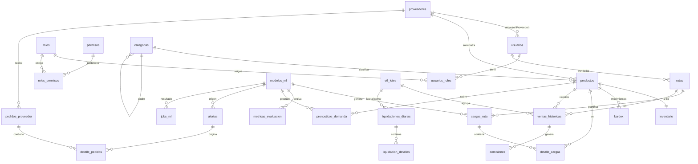

# Base de datos del sistema — Documentación detallada

Sistema de Análisis Predictivo (ML) · Desarrollos Comerciales del Sur, S.A.

Este documento describe la base de datos tal como está implementada en el código (modelos ORM en
`backend/app/domain/models/`, enumeraciones en `backend/app/domain/enums.py` y migraciones Alembic
0001–0005). Si hay diferencias con la especificación, prevalecen el contrato OpenAPI y el ER de
`docs/architecture/00-especificacion.md`.

---

## 1. Visión general

| Aspecto | Valor |
|---|---|
| Motor | PostgreSQL 16 (`postgres:16-alpine` en Docker, contenedor `ds-postgres`) |
| Acceso | SQLAlchemy 2.0 (estilo `Mapped[...]`), solo desde `repositories/` |
| Migraciones | Alembic, en `backend/app/db/migrations/versions/` |
| Seeds | `backend/app/db/seeds/seed_rbac.py` (idempotente) |
| Volumen Docker | `ds_pgdata` (`make clean-db` lo borra: destructivo) |
| Tablas | 27 (más `alembic_version`) |

### 1.1 Dominios funcionales

| Dominio | Módulo ORM | Tablas |
|---|---|---|
| Autenticación y RBAC | `auth.py` | `usuarios`, `roles`, `permisos`, `roles_permisos`, `usuarios_roles` |
| Catálogos e inventario | `catalog.py` | `categorias`, `proveedores`, `productos`, `rutas`, `inventario`, `kardex` |
| Operación comercial | `operations.py` | `cargas_ruta`, `detalle_cargas`, `pedidos_proveedor`, `detalle_pedidos` |
| Histórico y liquidación | `sales.py` | `etl_lotes`, `ventas_historicas`, `comisiones`, `liquidaciones_diarias`, `liquidacion_detalles` |
| Machine Learning | `ml.py` | `modelos_ml`, `metricas_evaluacion`, `pronosticos_demanda`, `alertas`, `parametros_sistema`, `jobs_ml` |
| Auditoría | `bitacora.py` | `bitacora` |

### 1.2 Flujo de datos de alto nivel

```
Excel históricos ──► etl_lotes ──► ventas_historicas ──┐
                                        ▲              ├──► entrenamiento ──► modelos_ml
Liquidación diaria ─► liquidaciones_diarias ──────────┘                          │
 (cierre, ADR-14)     liquidacion_detalles                                       ▼
        │                                                    pronosticos_demanda ──► cargas_ruta / detalle_cargas
        └─ rellena demanda_real ───────────────────────────►        │                       │
                                                                     ▼                       ▼
                                                        metricas_evaluacion ──► alertas   inventario ◄──► kardex
                                                                     │
                                                              jobs_ml (Worker)
```

1. El **histórico inicial** llega por Excel (`etl_lotes` → `ventas_historicas`).
2. Con ese histórico se **entrena** un modelo (`modelos_ml`) que genera **pronósticos** (`pronosticos_demanda`).
3. Un pronóstico + el stock disponible producen la **carga de ruta** sugerida (`cargas_ruta` / `detalle_cargas`).
4. Al despachar, se mueve el inventario y se registra en el `kardex`.
5. Al final del día, la **liquidación diaria** es la única entrada de ventas: cerrarla escribe
   `ventas_historicas` (lote con `origen='liquidacion'`), rellena `demanda_real` y encola una evaluación.
6. El **Worker** evalúa el modelo en producción (`metricas_evaluacion`), crea `alertas` si el MAPE supera
   el umbral y puede encolar reentrenamientos (`jobs_ml`).
7. Todo lo ejecutado queda en la `bitacora` (append-only).

---

## 2. Convenciones de diseño

Definidas en `domain/models/base.py` y en la sección 3.1 de la especificación.

| Convención | Detalle |
|---|---|
| Clave primaria de negocio | `uuid` con `server_default gen_random_uuid()` (`UUIDPkMixin`) |
| PK de alto volumen | `bigint GENERATED ALWAYS AS IDENTITY` (`kardex`, `ventas_historicas`, `pronosticos_demanda`, `bitacora`) |
| PK de catálogos pequeños | `smallint IDENTITY` (`roles`, `permisos`) |
| Fechas/horas | `timestamptz` en UTC (`type_annotation_map` mapea `datetime` a `DateTime(timezone=True)`); `date` para fechas de negocio |
| Montos | `numeric(14,2)` (tipo `Monto`) |
| Cantidades | `numeric(12,2)` (tipo `Cantidad`) |
| Porcentajes de error | `numeric(7,3)` (tipo `PorcentajeError`) |
| Estados y tipos | `varchar` + `CHECK ... IN (...)` generado con `sql_in()` desde `enums.py`; **no** se usan ENUM nativos |
| Auditoría de fila | `CreadoEnMixin` (`creado_en`) y `AuditoriaMixin` (`creado_en` + `actualizado_en` con `onupdate`) |
| Borrado | Preferencia por baja lógica (`activo`/`activa`); FKs `RESTRICT` salvo donde se indica |
| JSON | `JSONB` para datos semiestructurados (errores ETL, hiperparámetros, parámetros de jobs, bitácora) |

### 2.1 Nombres de constraints (deterministas)

`NAMING_CONVENTION` en `base.py`:

| Tipo | Patrón |
|---|---|
| Índice | `ix_<tabla>_<columnas>` |
| Único | `uq_<tabla>_<columnas>` |
| Check | `ck_<tabla>_<nombre>` |
| Foreign key | `fk_<tabla>_<columna>_<tabla_referida>` |
| Primary key | `pk_<tabla>` |

Ejemplo: el check `estado_valido` de `cargas_ruta` se llama `ck_cargas_ruta_estado_valido`.

### 2.2 Reglas de migración

- **Nunca** modificar una migración ya aplicada: crear otra (`make revision m="..."`).
- Revisar la migración autogenerada a mano y verificar con `alembic check` (sin drift) y `upgrade`/`downgrade`.
- Todo modelo nuevo debe importarse en `domain/models/__init__.py` para que Alembic lo detecte.

| Migración | Contenido |
|---|---|
| `20260929_0001_esquema_inicial` | Esquema base (auth, catálogos, operación, ventas, ML) |
| `20260930_0002_liquidacion_diaria_de_ventas` | `liquidaciones_diarias`, `liquidacion_detalles`; columnas `etl_lotes.origen`, `modelos_ml.fuentes_datos`, `pronosticos_demanda.demanda_censurada`; amplía el CHECK de `alertas.tipo` (`diferencia_caja`) |
| `20261001_0003_bitacora_de_auditoria` | Tabla `bitacora`, función `bitacora_inmutable()` y triggers de solo inserción |
| `20261002_0004_kardex_motivo_ajuste` | Columna `kardex.motivo` |
| `20261006_0005_renombrar_roles_y_liquidador` | Renombra roles a los nombres canónicos (conserva ids) y asegura el rol `Liquidador` con sus 3 permisos |

---

## 3. Diagrama entidad-relación (resumen)



---

## 4. Autenticación y RBAC (`auth.py`)

El control de acceso es por permisos `recurso:accion`. Un usuario tiene uno o más roles y cada rol
agrupa permisos. La matriz rol→permiso vive en el seed (`MATRIZ_ROL_PERMISO`) y en la sección 1.4 de
la especificación.

### 4.1 `usuarios`

| Columna | Tipo | Nulo | Detalle |
|---|---|---|---|
| `id` | uuid | NO | PK, `gen_random_uuid()` |
| `email` | varchar(254) | NO | **Único** |
| `password_hash` | varchar(255) | NO | Hash de contraseña (nunca en claro) |
| `nombre_completo` | varchar(150) | NO | |
| `proveedor_id` | uuid | SÍ | FK → `proveedores.id` (`SET NULL`), indexado. Solo para usuarios con rol Proveedor (aislamiento por fila, TC-RBAC-03) |
| `activo` | boolean | NO | Default `true` (baja lógica) |
| `ultimo_login` | timestamptz | SÍ | |
| `creado_en` / `actualizado_en` | timestamptz | NO | `now()`; `actualizado_en` se refresca en cada UPDATE |

### 4.2 `roles`

| Columna | Tipo | Nulo | Detalle |
|---|---|---|---|
| `id` | smallint | NO | PK `IDENTITY ALWAYS` |
| `nombre` | varchar(50) | NO | **Único** |
| `descripcion` | varchar(255) | SÍ | |

Roles sembrados: `Administrador`, `EncargadoInventario`, `EncargadoVentas`, `EncargadoBodega`, `EncargadoCompras`, `Gerente`, `Proveedor`, `Liquidador`.
(`Worker` aparece en la matriz de la especificación pero **no** es un rol de login.)

### 4.3 `permisos`

| Columna | Tipo | Nulo | Detalle |
|---|---|---|---|
| `id` | smallint | NO | PK `IDENTITY ALWAYS` |
| `codigo` | varchar(60) | NO | **Único**, formato `recurso:accion` (p. ej. `carga_ruta:aprobar`, `ml:metricas:leer`) |
| `descripcion` | varchar(255) | SÍ | |

Permisos sembrados (23): `usuarios:gestionar`, `etl:cargar`, `etl:configurar`, `prediccion:consultar`,
`carga_ruta:generar|aprobar|despachar`, `inventario:leer|ajustar`, `productos:crear|editar|eliminar`,
`pedido_proveedor:gestionar|confirmar`, `ml:metricas:leer`, `ml:reentrenar`, `alertas:leer`,
`reportes:leer`, `liquidaciones:registrar|cerrar|corregir|leer`, `bitacora:leer`.

### 4.4 `roles_permisos` (tabla puente)

| Columna | Tipo | Detalle |
|---|---|---|
| `rol_id` | smallint | PK (compuesta) y FK → `roles.id` `ON DELETE CASCADE` |
| `permiso_id` | smallint | PK (compuesta) y FK → `permisos.id` `ON DELETE CASCADE` |

### 4.5 `usuarios_roles` (tabla puente)

| Columna | Tipo | Detalle |
|---|---|---|
| `usuario_id` | uuid | PK (compuesta) y FK → `usuarios.id` `ON DELETE CASCADE` |
| `rol_id` | smallint | PK (compuesta) y FK → `roles.id` `ON DELETE CASCADE` |
| `asignado_en` | timestamptz | `now()` |

### 4.6 Matriz resumida rol → permisos (según el seed)

| Rol | Permisos |
|---|---|
| Administrador | Todos |
| EncargadoInventario | `etl:cargar`, `prediccion:consultar`, `inventario:leer`, `inventario:ajustar`, `productos:crear/editar/eliminar`, `alertas:leer` |
| EncargadoVentas | `etl:cargar`, `prediccion:consultar`, `carga_ruta:generar`, `carga_ruta:aprobar`, `inventario:leer`, `alertas:leer` |
| EncargadoBodega | `carga_ruta:despachar`, `inventario:leer`, `inventario:ajustar`, `alertas:leer` |
| EncargadoCompras | `prediccion:consultar`, `inventario:leer`, `pedido_proveedor:gestionar`, `alertas:leer` |
| Gerente | `reportes:leer`, `prediccion:consultar`, `carga_ruta:aprobar`, `inventario:leer`, `ml:metricas:leer`, `ml:reentrenar`, `alertas:leer`, `liquidaciones:leer` |
| Proveedor | `pedido_proveedor:confirmar` |
| Liquidador | `liquidaciones:registrar`, `liquidaciones:cerrar`, `liquidaciones:leer` |

`bitacora:leer`, `etl:configurar` y `liquidaciones:corregir` solo los tiene Administrador.

---

## 5. Catálogos e inventario (`catalog.py`)

### 5.1 `categorias`

| Columna | Tipo | Nulo | Detalle |
|---|---|---|---|
| `id` | uuid | NO | PK |
| `nombre` | varchar(100) | NO | **Único** |
| `categoria_padre_id` | uuid | SÍ | FK → `categorias.id` (`RESTRICT`), indexado; jerarquía autorreferenciada |

CHECK `no_autorreferencia`: `categoria_padre_id <> id`.

### 5.2 `proveedores`

| Columna | Tipo | Nulo | Detalle |
|---|---|---|---|
| `id` | uuid | NO | PK |
| `nombre` | varchar(150) | NO | |
| `nit` | varchar(20) | NO | **Único** |
| `email` | varchar(254) | SÍ | |
| `lead_time_dias` | integer | NO | Default 0 (días de reposición) |
| `activo` | boolean | NO | Default `true` |

CHECK `lead_time_no_negativo`: `lead_time_dias >= 0`.

### 5.3 `productos`

| Columna | Tipo | Nulo | Detalle |
|---|---|---|---|
| `id` | uuid | NO | PK |
| `sku` | varchar(30) | NO | **Único**, en mayúsculas (ADR-16) |
| `nombre` | varchar(200) | NO | |
| `categoria_id` | uuid | NO | FK → `categorias.id` (`RESTRICT`), indexado |
| `proveedor_id` | uuid | SÍ | FK → `proveedores.id` (`RESTRICT`), indexado. **Nullable** por desviación documentada del ER: los Excel históricos no traen proveedor |
| `unidad_medida` | varchar(20) | NO | Default `'unidad'` |
| `precio_venta` | numeric(14,2) | NO | Default 0 |
| `costo_unitario` | numeric(14,2) | NO | Default 0 |
| `stock_minimo` | numeric(12,2) | NO | Default 0 (umbral de alerta `stock_bajo`) |
| `activo` | boolean | NO | Default `true` |
| `creado_en` | timestamptz | NO | `now()` |

CHECK `valores_no_negativos`: `precio_venta >= 0 AND costo_unitario >= 0 AND stock_minimo >= 0`.

Reglas (ADR-16): baja **lógica** (`activo=false`, nunca `DELETE`; si está en uso responde 409
`PRODUCTO_EN_USO`); el alta crea automáticamente su fila en `inventario` con stock 0. En los Excel el
producto se identifica por *medida* + *sabor* y el SKU a veces falta.

### 5.4 `rutas`

| Columna | Tipo | Nulo | Detalle |
|---|---|---|---|
| `id` | uuid | NO | PK |
| `codigo` | varchar(20) | NO | **Único** |
| `nombre` | varchar(100) | NO | |
| `zona` | varchar(100) | SÍ | |
| `vendedor_id` | uuid | SÍ | FK → `usuarios.id` (`SET NULL`), indexado |
| `activa` | boolean | NO | Default `true` |

### 5.5 `inventario`

Existencias actuales: **una sola fila por producto**.

| Columna | Tipo | Nulo | Detalle |
|---|---|---|---|
| `id` | uuid | NO | PK |
| `producto_id` | uuid | NO | FK → `productos.id` (`RESTRICT`), **único** |
| `stock_actual` | numeric(12,2) | NO | Default 0 |
| `stock_reservado` | numeric(12,2) | NO | Default 0 (comprometido en cargas aprobadas) |
| `actualizado_en` | timestamptz | NO | `now()`, se refresca en UPDATE |

CHECKs: `integridad_existencias` (`stock_actual >= 0 AND stock_reservado <= stock_actual`) y
`reservado_no_negativo` (`stock_reservado >= 0`).

Propiedad calculada (no es columna): `stock_disponible = stock_actual - stock_reservado`.

### 5.6 `kardex`

Libro de movimientos de inventario (append lógico, alto volumen).

| Columna | Tipo | Nulo | Detalle |
|---|---|---|---|
| `id` | bigint | NO | PK `IDENTITY ALWAYS` |
| `producto_id` | uuid | NO | FK → `productos.id` (`RESTRICT`) |
| `tipo_movimiento` | varchar(12) | NO | `entrada`, `salida`, `ajuste`, `reserva`, `liberacion` |
| `cantidad` | numeric(12,2) | NO | En `ajuste` se guarda **con signo** |
| `saldo_resultante` | numeric(12,2) | NO | Saldo tras el movimiento |
| `referencia_tipo` | varchar(15) | SÍ | `carga_ruta`, `pedido`, `ajuste`, `etl` |
| `referencia_id` | uuid | SÍ | Id del documento origen (sin FK, es polimórfico) |
| `usuario_id` | uuid | SÍ | FK → `usuarios.id` (`RESTRICT`), indexado. `NULL` si lo genera un proceso (ETL/Worker) |
| `fecha_movimiento` | timestamptz | NO | `now()` |
| `motivo` | varchar(300) | SÍ | Justificación obligatoria (5–300 caracteres) en ajustes manuales (ADR-16); `NULL` en el resto |

CHECKs: `tipo_movimiento_valido`, `referencia_tipo_valida` (permite `NULL`), `saldo_no_negativo`
(`saldo_resultante >= 0`).
Índice: `ix_kardex_producto_fecha (producto_id, fecha_movimiento DESC)`.

**Ajuste de stock** (`POST /inventory/adjustments`): bloquea la fila con `FOR UPDATE`, nunca baja
`stock_reservado`, y registra el movimiento `ajuste` con signo y `motivo`. Modalidades (`TipoAjuste`):
`incremento`, `decremento`, `fijar`.

---

## 6. Operación comercial (`operations.py`)

### 6.1 `cargas_ruta`

Cabecera del plan de carga de una ruta para un día.

| Columna | Tipo | Nulo | Detalle |
|---|---|---|---|
| `id` | uuid | NO | PK |
| `ruta_id` | uuid | NO | FK → `rutas.id` (`RESTRICT`) |
| `fecha_operacion` | date | NO | |
| `estado` | varchar(25) | NO | Default `'borrador'` |
| `modelo_id` | uuid | NO | FK → `modelos_ml.id` (`RESTRICT`), indexado: modelo que generó la sugerencia |
| `generado_por` | uuid | NO | FK → `usuarios.id` (`RESTRICT`), indexado |
| `aprobado_por` | uuid | SÍ | FK → `usuarios.id` (`RESTRICT`) |
| `observaciones` | text | SÍ | |
| `generada_en` | timestamptz | NO | `now()` |
| `aprobada_en` | timestamptz | SÍ | |
| `actualizado_en` | timestamptz | NO | `now()` |

**Máquina de estados:**
```
borrador → pendiente_aprobacion → aprobada → despachada
                               └→ rechazada
```
Nunca se despacha automáticamente (ADR-06).

Restricciones:
- `ck_cargas_ruta_estado_valido`: estado ∈ {`borrador`, `pendiente_aprobacion`, `aprobada`, `rechazada`, `despachada`}.
- `aprobacion_completa`: si el estado es `aprobada` o `despachada`, `aprobado_por` y `aprobada_en` no pueden ser `NULL`.
- Índice único parcial `uq_cargas_ruta_vigente_ruta_fecha (ruta_id, fecha_operacion)` **donde** estado ∈ {`borrador`, `pendiente_aprobacion`, `aprobada`}: **una sola carga vigente por ruta y día** (TC-LOAD-04). Una `rechazada` o `despachada` libera el cupo.

### 6.2 `detalle_cargas`

Una línea por producto de la carga.

| Columna | Tipo | Nulo | Detalle |
|---|---|---|---|
| `id` | uuid | NO | PK |
| `carga_id` | uuid | NO | FK → `cargas_ruta.id` `ON DELETE CASCADE` |
| `producto_id` | uuid | NO | FK → `productos.id` (`RESTRICT`), indexado |
| `cantidad_predicha` | numeric(12,2) | NO | Demanda pronosticada |
| `stock_disponible_al_generar` | numeric(12,2) | NO | Foto del stock disponible al momento de generar |
| `cantidad_sugerida` | numeric(12,2) | NO | `min(predicha, stock_disponible)` |
| `cantidad_aprobada` | numeric(12,2) | SÍ | Cantidad final autorizada |
| `ajustado_por_stock` | boolean | NO | Default `false`; `true` si la sugerida se recortó por falta de stock |

Restricciones: único (`carga_id`, `producto_id`) y tres CHECK que blindan la regla de negocio crítica:

| CHECK | Expresión | Regla |
|---|---|---|
| `cantidades_no_negativas` | `cantidad_predicha >= 0 AND stock_disponible_al_generar >= 0 AND cantidad_sugerida >= 0` | |
| `sugerida_min_demanda_stock` | `cantidad_sugerida = LEAST(cantidad_predicha, stock_disponible_al_generar)` | **ADR-07** |
| `aprobada_no_excede_stock` | `cantidad_aprobada IS NULL OR (cantidad_aprobada >= 0 AND cantidad_aprobada <= stock_disponible_al_generar)` | TC-LOAD-02 |

El servicio valida antes de insertar y responde `400 CANTIDAD_EXCEDE_STOCK`; el CHECK es la última defensa.

### 6.3 `pedidos_proveedor`

| Columna | Tipo | Nulo | Detalle |
|---|---|---|---|
| `id` | uuid | NO | PK |
| `proveedor_id` | uuid | NO | FK → `proveedores.id` (`RESTRICT`) |
| `creado_por` | uuid | NO | FK → `usuarios.id` (`RESTRICT`), indexado |
| `estado` | varchar(12) | NO | Default `'borrador'`: `borrador`, `enviado`, `confirmado`, `recibido`, `cancelado` |
| `fecha_pedido` | date | NO | Default `CURRENT_DATE` |
| `fecha_esperada` | date | SÍ | |
| `total` | numeric(14,2) | NO | Default 0 |
| `creado_en` / `actualizado_en` | timestamptz | NO | |

CHECKs: `estado_valido`, `total_no_negativo`, `fechas_coherentes` (`fecha_esperada IS NULL OR fecha_esperada >= fecha_pedido`).
Índice: `ix_pedidos_proveedor_proveedor_estado (proveedor_id, estado)` para el aislamiento del actor Proveedor.

### 6.4 `detalle_pedidos`

| Columna | Tipo | Nulo | Detalle |
|---|---|---|---|
| `id` | uuid | NO | PK |
| `pedido_id` | uuid | NO | FK → `pedidos_proveedor.id` `ON DELETE CASCADE` |
| `producto_id` | uuid | NO | FK → `productos.id` (`RESTRICT`), indexado |
| `alerta_origen_id` | uuid | SÍ | FK → `alertas.id` (`SET NULL`), indexado: alerta que motivó la compra |
| `cantidad` | numeric(12,2) | NO | |
| `costo_unitario` | numeric(14,2) | NO | |

Único (`pedido_id`, `producto_id`). CHECK `valores_validos`: `cantidad > 0 AND costo_unitario >= 0`.

---

## 7. Histórico de ventas y liquidación (`sales.py`)

### 7.1 `etl_lotes`

Un registro por archivo Excel procesado **o** por cierre de liquidación.

| Columna | Tipo | Nulo | Detalle |
|---|---|---|---|
| `id` | uuid | NO | PK |
| `usuario_id` | uuid | NO | FK → `usuarios.id` (`RESTRICT`), indexado |
| `archivo_nombre` | varchar(255) | NO | |
| `checksum_sha256` | char(64) | NO | **Único**: impide cargar dos veces el mismo archivo (TC-ETL-02) |
| `estado` | varchar(12) | NO | Default `'recibido'`: `recibido`, `validado`, `rechazado`, `cargado` |
| `filas_totales` / `filas_validas` / `filas_rechazadas` | integer | NO | Default 0 |
| `errores` | jsonb | SÍ | Detalle de filas rechazadas |
| `origen` | varchar(20) | NO | Default `'excel_historico'`; también `'liquidacion'` (ADR-14) |
| `creado_en` | timestamptz | NO | `now()` |

CHECKs: `estado_valido`, `origen_valido`, `conteos_coherentes`
(`filas_validas + filas_rechazadas <= filas_totales`, todos ≥ 0).

### 7.2 `ventas_historicas`

Tabla de hechos de venta (insumo del entrenamiento). Alto volumen.

| Columna | Tipo | Nulo | Detalle |
|---|---|---|---|
| `id` | bigint | NO | PK `IDENTITY ALWAYS` |
| `lote_id` | uuid | NO | FK → `etl_lotes.id` (`RESTRICT`), indexado |
| `fecha_venta` | date | NO | |
| `producto_id` | uuid | NO | FK → `productos.id` (`RESTRICT`) |
| `ruta_id` | uuid | NO | FK → `rutas.id` (`RESTRICT`) |
| `vendedor_id` | uuid | SÍ | FK → `usuarios.id` (`RESTRICT`), indexado |
| `cantidad` | numeric(12,2) | NO | |
| `precio_unitario` | numeric(14,2) | NO | |
| `monto_total` | numeric(14,2) | NO | |

Restricciones:
- Único `uq_ventas_historicas_fecha_producto_ruta_vendedor (fecha_venta, producto_id, ruta_id, vendedor_id)` con **`NULLS NOT DISTINCT`** (PostgreSQL ≥ 15): hace idempotente la recarga (`ON CONFLICT`) incluso cuando `vendedor_id` es `NULL`.
- CHECK `calidad_datos` (`cantidad >= 0 AND precio_unitario >= 0`) y `monto_no_negativo`.
- Índices: `ix_ventas_historicas_producto_fecha (producto_id, fecha_venta)` y `ix_ventas_historicas_ruta_fecha (ruta_id, fecha_venta)`.

### 7.3 `comisiones`

| Columna | Tipo | Nulo | Detalle |
|---|---|---|---|
| `id` | uuid | NO | PK |
| `vendedor_id` | uuid | NO | FK → `usuarios.id` (`RESTRICT`) |
| `venta_id` | bigint | NO | FK → `ventas_historicas.id` `ON DELETE CASCADE` |
| `periodo` | char(7) | NO | Formato `YYYY-MM` |
| `porcentaje` | numeric(7,3) | NO | |
| `monto` | numeric(14,2) | NO | |

Único (`venta_id`, `vendedor_id`). CHECKs: `periodo_formato` (regex `^\d{4}-(0[1-9]|1[0-2])$`),
`porcentaje_rango` (0–100), `monto_no_negativo`. Índice `ix_comisiones_vendedor_periodo (vendedor_id, periodo)`.

### 7.4 `liquidaciones_diarias` (ADR-14)

Cabecera de la liquidación del día por **ruta + vendedor**: dinero, cuadre de caja y trazabilidad.

| Columna | Tipo | Nulo | Detalle |
|---|---|---|---|
| `id` | uuid | NO | PK |
| `fecha` | date | NO | |
| `ruta_id` | uuid | NO | FK → `rutas.id` (`RESTRICT`) |
| `vendedor_id` | uuid | NO | FK → `usuarios.id` (`RESTRICT`), indexado |
| `estado` | varchar(10) | NO | Default `'borrador'`: `borrador`, `cerrada`, `anulada` |
| `version` | integer | NO | Default 1 (se incrementa con correcciones) |
| `lote_id` | uuid | SÍ | FK → `etl_lotes.id` (`RESTRICT`), indexado: lote creado al cerrar |
| `venta_total` | numeric(14,2) | NO | Default 0 |
| `total_efectivo` | numeric(14,2) | NO | Default 0 |
| `total_transferencia` | numeric(14,2) | NO | Default 0 |
| `total_credito` | numeric(14,2) | NO | Default 0 |
| `cobro_saldos_anteriores` | numeric(14,2) | NO | Default 0 |
| `gastos_ruta` | numeric(14,2) | NO | Default 0 |
| `efectivo_esperado` | numeric(14,2) | NO | Calculado |
| `efectivo_entregado` | numeric(14,2) | NO | Lo que realmente entrega el vendedor |
| `diferencia_caja` | numeric(14,2) | NO | `entregado − esperado` |
| `observaciones` | text | SÍ | |
| `creado_por` | uuid | NO | FK → `usuarios.id` (`RESTRICT`), indexado |
| `creado_en` / `actualizado_en` | timestamptz | NO | |
| `cerrado_en` | timestamptz | SÍ | |
| `anulado_en` | timestamptz | SÍ | |
| `anulado_motivo` | text | SÍ | |
| `historial` | jsonb | NO | Default `'[]'`: bitácora propia (usuario, antes y después) de creación/cierre/corrección/anulación |

**Fórmulas blindadas por CHECK:**
```
efectivo_esperado = total_efectivo + cobro_saldos_anteriores − gastos_ruta      (cuadre_caja_coherente)
diferencia_caja   = efectivo_entregado − efectivo_esperado                       (cuadre_caja_coherente)
venta_total       = total_efectivo + total_transferencia + total_credito         (venta_igual_pagos, solo si estado = 'cerrada')
```

Otros CHECK: `estado_valido`, `version_positiva` (≥ 1), `montos_no_negativos`,
`cierre_completo` (cerrada ⇒ `cerrado_en` y `lote_id` no nulos),
`anulacion_completa` (anulada ⇒ `anulado_en` y `anulado_motivo` no nulos).

Índices: único parcial `uq_liquidaciones_diarias_vigente (fecha, ruta_id, vendedor_id)` **donde**
`estado <> 'anulada'` (una liquidación vigente por fecha/ruta/vendedor) y
`ix_liquidaciones_diarias_fecha_ruta (fecha, ruta_id)`.

Si `diferencia_caja` supera `liquidacion.umbral_diferencia_caja` se genera una alerta de tipo `diferencia_caja`.

### 7.5 `liquidacion_detalles`

Una línea por presentación de producto de la liquidación.

| Columna | Tipo | Nulo | Detalle |
|---|---|---|---|
| `id` | uuid | NO | PK |
| `liquidacion_id` | uuid | NO | FK → `liquidaciones_diarias.id` `ON DELETE CASCADE` |
| `producto_id` | uuid | NO | FK → `productos.id` (`RESTRICT`), indexado |
| `cantidad_cargada` | numeric(12,2) | NO | |
| `cantidad_vendida` | numeric(12,2) | NO | |
| `cantidad_devuelta` | numeric(12,2) | NO | Default 0 |
| `cantidad_merma` | numeric(12,2) | NO | Default 0 |
| `precio_unitario` | numeric(14,2) | NO | |
| `monto_total` | numeric(14,2) | NO | |
| `agotado` | boolean | NO | Default `false`. Se agotó antes de terminar la ruta → la venta es un **piso** de la demanda (censura) |
| `justificacion_carga` | text | SÍ | |

Único (`liquidacion_id`, `producto_id`). CHECKs: `valores_no_negativos`,
`unidades_no_exceden_cargada` (`vendida + devuelta + merma <= cargada`),
`monto_coherente` (`monto_total = round(cantidad_vendida * precio_unitario, 2)`).

### 7.6 Qué ocurre al cerrar una liquidación

1. Se crea un `etl_lotes` con `origen='liquidacion'`.
2. Se escriben las líneas en `ventas_historicas` ligadas a ese lote.
3. Se rellena `pronosticos_demanda.demanda_real`; si hubo `agotado`, se marca `demanda_censurada=true`
   (esa fila no cuenta para evaluar error).
4. Se encola un job `evaluacion_produccion` en `jobs_ml`.

Tras el arranque, es la **única** entrada de ventas; con `etl.carga_excel_habilitada=false` el ETL responde 409.

---

## 8. Machine Learning (`ml.py`)

### 8.1 `modelos_ml`

Registro (versionado) de modelos entrenados.

| Columna | Tipo | Nulo | Detalle |
|---|---|---|---|
| `id` | uuid | NO | PK |
| `nombre` | varchar(80) | NO | Familia lógica del modelo |
| `algoritmo` | varchar(20) | NO | `sklearn`, `xgboost`, `lstm` |
| `version` | varchar(20) | NO | |
| `estado` | varchar(15) | NO | Default `'candidato'`: `candidato`, `produccion`, `archivado`, `descartado` |
| `ruta_artefacto` | varchar(255) | NO | Ruta del archivo serializado (volumen `ds_ml_artifacts`) |
| `hash_artefacto` | char(64) | NO | SHA-256 del artefacto (integridad) |
| `hiperparametros` | jsonb | NO | |
| `esquema_features` | jsonb | NO | Features usadas |
| `ventana_desde` / `ventana_hasta` | date | NO | Rango de datos de entrenamiento |
| `motivo_entrenamiento` | varchar(15) | NO | `programado`, `manual`, `degradacion` |
| `entrenado_por` | uuid | SÍ | FK → `usuarios.id` (`SET NULL`); `NULL` si lo entrenó el Worker |
| `entrenado_en` | timestamptz | NO | `now()` |
| `promovido_en` | timestamptz | SÍ | |
| `fuentes_datos` | jsonb | SÍ | ADR-14: fuente, rango de fechas y filas por origen (`excel_historico` / `liquidacion`) |

Restricciones:
- Único (`nombre`, `version`).
- Índice único parcial `uq_modelos_ml_produccion_nombre (nombre)` **donde** `estado = 'produccion'`: **un único modelo en producción por familia** (ADR-03).
- CHECKs: `algoritmo_valido`, `estado_valido`, `motivo_valido`, `ventana_coherente` (`desde < hasta`), `produccion_promovido` (producción ⇒ `promovido_en` no nulo).

### 8.2 `metricas_evaluacion`

| Columna | Tipo | Nulo | Detalle |
|---|---|---|---|
| `id` | uuid | NO | PK |
| `modelo_id` | uuid | NO | FK → `modelos_ml.id` (`RESTRICT`) |
| `producto_id` | uuid | SÍ | FK → `productos.id` (`RESTRICT`), indexado. `NULL` = métrica global del modelo |
| `tipo_evaluacion` | varchar(12) | NO | `holdout`, `backtest`, `produccion` |
| `mae` | numeric(12,4) | NO | Error absoluto medio |
| `rmse` | numeric(12,4) | NO | Raíz del error cuadrático medio |
| `mape` | numeric(7,3) | SÍ | `NULL` si la demanda real es 0 en todo el periodo (evita división por cero silenciosa) |
| `n_muestras` | integer | NO | > 0 |
| `periodo_desde` / `periodo_hasta` | date | NO | |
| `supera_umbral` | boolean | NO | Default `false` |
| `evaluado_en` | timestamptz | NO | `now()` |

CHECKs: `tipo_valido`, `errores_no_negativos`, `mape_no_negativo`, `n_muestras_positivo`, `periodo_coherente`.
Índice: `ix_metricas_evaluacion_modelo_tipo_periodo (modelo_id, tipo_evaluacion, periodo_hasta DESC)` (serie de degradación).

### 8.3 `pronosticos_demanda`

| Columna | Tipo | Nulo | Detalle |
|---|---|---|---|
| `id` | bigint | NO | PK `IDENTITY ALWAYS` |
| `modelo_id` | uuid | NO | FK → `modelos_ml.id` (`RESTRICT`) |
| `producto_id` | uuid | NO | FK → `productos.id` (`RESTRICT`) |
| `ruta_id` | uuid | SÍ | FK → `rutas.id` (`RESTRICT`), indexado. `NULL` = demanda agregada |
| `fecha_objetivo` | date | NO | Día pronosticado |
| `horizonte_dias` | integer | NO | 1 a 30 |
| `demanda_predicha` | numeric(12,2) | NO | |
| `limite_inferior` / `limite_superior` | numeric(12,2) | SÍ | Intervalo de predicción |
| `demanda_real` | numeric(12,2) | SÍ | Se rellena al cerrar la liquidación |
| `demanda_censurada` | boolean | NO | Default `false`; `true` si hubo agotado (la real es un piso y no se evalúa su error) |
| `generado_en` | timestamptz | NO | `now()` |

Restricciones: único `uq_pronosticos_demanda_clave (modelo_id, producto_id, ruta_id, fecha_objetivo, horizonte_dias)`
con `NULLS NOT DISTINCT`; CHECKs `horizonte_rango`, `predicha_no_negativa`, `real_no_negativa`,
`intervalo_coherente` (`inferior <= predicha <= superior`). Índice `ix_pronosticos_demanda_fecha_producto (fecha_objetivo, producto_id)`.

### 8.4 `alertas`

| Columna | Tipo | Nulo | Detalle |
|---|---|---|---|
| `id` | uuid | NO | PK |
| `tipo` | varchar(25) | NO | `stock_bajo`, `quiebre_proyectado`, `mape_umbral`, `etl_error`, `diferencia_caja` |
| `severidad` | varchar(12) | NO | `info`, `advertencia`, `critica` |
| `producto_id` | uuid | SÍ | FK → `productos.id` (`RESTRICT`), indexado |
| `modelo_id` | uuid | SÍ | FK → `modelos_ml.id` (`RESTRICT`), indexado |
| `mensaje` | text | NO | |
| `estado` | varchar(12) | NO | Default `'abierta'`: `abierta`, `reconocida`, `resuelta` |
| `creada_en` | timestamptz | NO | `now()` |
| `resuelta_en` | timestamptz | SÍ | |

CHECKs: `tipo_valido`, `severidad_valida`, `estado_valido`, `resolucion_fechada` (resuelta ⇒ `resuelta_en` no nulo).
Índice de bandeja: `ix_alertas_estado_severidad_creada (estado, severidad, creada_en DESC)`.

### 8.5 `parametros_sistema`

Configuración clave/valor editable en caliente (acceso mediante `core/parametros.py`).

| Columna | Tipo | Nulo | Detalle |
|---|---|---|---|
| `clave` | varchar(100) | NO | PK |
| `valor` | jsonb | NO | |
| `actualizado_por` | uuid | SÍ | FK → `usuarios.id` (`SET NULL`) |
| `actualizado_en` | timestamptz | NO | `now()` |

| Clave | Valor inicial | Significado |
|---|---|---|
| `ml.mape_umbral` | `12.0` | MAPE (%) a partir del cual se considera degradación (ADR-08) |
| `ml.periodos_consecutivos` | `3` | Periodos seguidos sobre el umbral para reentrenar (ADR-08) |
| `ml.fuente_reentrenamiento` | `"excel_mas_liquidacion"` | Datos para reentrenar: `excel_historico`, `excel_mas_liquidacion` o `liquidacion` |
| `etl.carga_excel_habilitada` | `true` | Si es `false`, la carga de Excel responde 409 |
| `liquidacion.umbral_diferencia_caja` | `10.00` | Diferencia de caja que dispara alerta |
| `comisiones.porcentaje` | (no se siembra en el seed) | Porcentaje de comisión; lo administra el negocio |

El seed crea las claves de ADR-14 solo si faltan y nunca pisa un cambio hecho por el negocio.

### 8.6 `jobs_ml`

Cola de trabajos asíncronos del Worker (ADR-04).

| Columna | Tipo | Nulo | Detalle |
|---|---|---|---|
| `id` | uuid | NO | PK |
| `tipo` | varchar(25) | NO | `reentrenamiento`, `evaluacion_produccion`, `pronostico_nocturno` |
| `estado` | varchar(15) | NO | Default `'en_cola'`: `en_cola`, `en_ejecucion`, `completado`, `fallido` |
| `parametros` | jsonb | NO | Default `'{}'` |
| `solicitado_por` | uuid | SÍ | FK → `usuarios.id` (`SET NULL`) |
| `resultado_modelo_id` | uuid | SÍ | FK → `modelos_ml.id` (`SET NULL`): modelo producido |
| `solicitado_en` | timestamptz | NO | `now()` |
| `iniciado_en` / `finalizado_en` | timestamptz | SÍ | |
| `error` | text | SÍ | Mensaje si falló |

CHECKs: `tipo_valido`, `estado_valido`, `tiempos_coherentes` (`finalizado_en >= iniciado_en`).
Índice de cola: `ix_jobs_ml_estado_solicitado (estado, solicitado_en)`.

El Worker (`python -m app.workers.main`) sondea cada `WORKER_POLL_SEGUNDOS`; un fallo en un job se
registra aquí (`estado='fallido'`, `error`) y no detiene al Worker.

---

## 9. Auditoría: `bitacora` (ADR-15)

Registro **append-only** de todo lo que ejecuta el sistema: una fila por petición HTTP, por caso de uso
de servicio (`@auditar`) y por job del Worker.

| Columna | Tipo | Nulo | Detalle |
|---|---|---|---|
| `id` | bigint | NO | PK `IDENTITY ALWAYS` |
| `ocurrido_en` | timestamptz | NO | `now()` |
| `nivel` | varchar(7) | NO | `INFO`, `WARNING`, `ERROR` |
| `origen` | varchar(10) | NO | `http`, `servicio`, `worker` |
| `operacion` | varchar(10) | NO | `lectura`, `escritura` |
| `accion` | varchar(200) | NO | Función ejecutada (`services.etl_service.procesar_excel`) o `METODO /ruta` en origen http |
| `resultado` | varchar(5) | NO | `exito`, `error` |
| `usuario_id` | uuid | SÍ | **Sin FK** a `usuarios`: el rastro sobrevive al borrado del usuario |
| `ip` | varchar(45) | SÍ | IPv4/IPv6 |
| `request_id` | varchar(36) | SÍ | Une el registro http con los de servicio de la misma petición (cabecera `X-Request-ID`) o del mismo ciclo del Worker |
| `metodo` | varchar(10) | SÍ | Verbo HTTP |
| `ruta` | varchar(300) | SÍ | |
| `status_code` | smallint | SÍ | |
| `duracion_ms` | integer | SÍ | |
| `parametros` | jsonb | SÍ | Argumentos **saneados** (sin contraseñas/tokens, truncados) |
| `codigo_error` | varchar(60) | SÍ | |
| `mensaje` | text | SÍ | |

Índices: `ix_bitacora_ocurrido_en`, `ix_bitacora_usuario_id`, `ix_bitacora_accion`, `ix_bitacora_request_id`.

**Inmutabilidad (migración 0003):** la función `bitacora_inmutable()` lanza una excepción
(`insufficient_privilege`, «La bitácora es de solo inserción») y dos triggers la invocan:
- `trg_bitacora_inmutable`: `BEFORE UPDATE OR DELETE` por fila.
- `trg_bitacora_sin_truncate`: `BEFORE TRUNCATE` por sentencia.

Notas de implementación: se escribe en una **sesión independiente** (un fallo al registrar nunca rompe la
operación); en tests está apagada (`bitacora_habilitada=False`, se activa con `@pytest.mark.bitacora`);
solo el rol Administrador puede leerla (`bitacora:leer`).

---

## 10. Enumeraciones (valores permitidos en los CHECK)

| Enum | Valores |
|---|---|
| `EstadoCarga` | `borrador`, `pendiente_aprobacion`, `aprobada`, `rechazada`, `despachada` |
| `TipoMovimiento` | `entrada`, `salida`, `ajuste`, `reserva`, `liberacion` |
| `ReferenciaTipo` | `carga_ruta`, `pedido`, `ajuste`, `etl` |
| `TipoAjuste` | `incremento`, `decremento`, `fijar` (solo lógica de servicio, no es columna) |
| `EstadoPedido` | `borrador`, `enviado`, `confirmado`, `recibido`, `cancelado` |
| `EstadoLoteEtl` | `recibido`, `validado`, `rechazado`, `cargado` |
| `OrigenDatos` | `excel_historico`, `liquidacion` |
| `EstadoLiquidacion` | `borrador`, `cerrada`, `anulada` |
| `FuenteReentrenamiento` | `excel_historico`, `excel_mas_liquidacion`, `liquidacion` (valor del parámetro, no columna) |
| `Algoritmo` | `sklearn`, `xgboost`, `lstm` |
| `EstadoModelo` | `candidato`, `produccion`, `archivado`, `descartado` |
| `MotivoEntrenamiento` | `programado`, `manual`, `degradacion` |
| `TipoEvaluacion` | `holdout`, `backtest`, `produccion` |
| `TipoAlerta` | `stock_bajo`, `quiebre_proyectado`, `mape_umbral`, `etl_error`, `diferencia_caja` |
| `Severidad` | `info`, `advertencia`, `critica` |
| `EstadoAlerta` | `abierta`, `reconocida`, `resuelta` |
| `TipoJob` | `reentrenamiento`, `evaluacion_produccion`, `pronostico_nocturno` |
| `EstadoJob` | `en_cola`, `en_ejecucion`, `completado`, `fallido` |
| `NivelBitacora` | `INFO`, `WARNING`, `ERROR` |
| `OrigenBitacora` | `http`, `servicio`, `worker` |
| `OperacionBitacora` | `lectura`, `escritura` |
| `ResultadoBitacora` | `exito`, `error` |

---

## 11. Políticas de borrado de claves foráneas

| Política | Dónde se usa | Efecto |
|---|---|---|
| `RESTRICT` | La mayoría de relaciones de negocio (producto, ruta, usuario, modelo, lote…) | No se puede borrar el padre si tiene hijos; refuerza la baja lógica |
| `CASCADE` | `detalle_cargas`, `detalle_pedidos`, `liquidacion_detalles`, `comisiones`, `roles_permisos`, `usuarios_roles` | Borrar la cabecera elimina sus líneas/asignaciones |
| `SET NULL` | `usuarios.proveedor_id`, `rutas.vendedor_id`, `detalle_pedidos.alerta_origen_id`, `modelos_ml.entrenado_por`, `parametros_sistema.actualizado_por`, `jobs_ml.solicitado_por`, `jobs_ml.resultado_modelo_id` | Se conserva el registro y se pierde solo la referencia |
| Sin FK | `bitacora.usuario_id`, `kardex.referencia_id` | Rastro/polimorfismo que debe sobrevivir a los borrados |

---

## 12. Índices únicos parciales y `NULLS NOT DISTINCT` (reglas de negocio en la BD)

| Índice / restricción | Tabla | Garantiza |
|---|---|---|
| `uq_cargas_ruta_vigente_ruta_fecha` (parcial: estado vigente) | `cargas_ruta` | Una sola carga vigente por ruta y día |
| `uq_modelos_ml_produccion_nombre` (parcial: `estado='produccion'`) | `modelos_ml` | Un único modelo en producción por familia (ADR-03) |
| `uq_liquidaciones_diarias_vigente` (parcial: `estado <> 'anulada'`) | `liquidaciones_diarias` | Una liquidación vigente por fecha/ruta/vendedor |
| `uq_ventas_historicas_fecha_producto_ruta_vendedor` (`NULLS NOT DISTINCT`) | `ventas_historicas` | Recargas idempotentes, aun sin vendedor |
| `uq_pronosticos_demanda_clave` (`NULLS NOT DISTINCT`) | `pronosticos_demanda` | Sin pronósticos duplicados del agregado (`ruta_id` NULL) |
| `checksum_sha256` único | `etl_lotes` | No se carga dos veces el mismo archivo |

---

## 13. Ciclo de vida de los datos

| Etapa | Qué se escribe |
|---|---|
| Arranque (`make migrate` + `make seed`) | Esquema, 8 roles, 23 permisos, matriz, admin inicial (`admin@ds.gt`, solo bootstrap local) y parámetros |
| Carga inicial de histórico | `etl_lotes` (origen `excel_historico`) + `ventas_historicas`; categorías/productos/rutas derivados de los Excel |
| Entrenamiento | `modelos_ml` (candidato) → promoción a `produccion` (archiva el anterior); `metricas_evaluacion` (holdout/backtest) |
| Predicción | `pronosticos_demanda` |
| Planificación de carga | `cargas_ruta` + `detalle_cargas`; reserva de stock (`inventario.stock_reservado`, `kardex` tipo `reserva`) |
| Despacho | `kardex` tipo `salida`; baja de `stock_actual` |
| Compras | `pedidos_proveedor` + `detalle_pedidos`; recepción ⇒ `kardex` tipo `entrada` |
| Liquidación diaria | `liquidaciones_diarias` + `liquidacion_detalles`; al cerrar: `etl_lotes` (origen `liquidacion`), `ventas_historicas`, `demanda_real` |
| Monitoreo (Worker) | `metricas_evaluacion` (producción), `alertas`, `jobs_ml` |
| Siempre | `bitacora` |

> Nota: el reparto exacto de movimientos de `kardex` por operación (p. ej. cuándo se usa `reserva` o
> `liberacion`) está en `services/`; este documento describe el esquema, no reemplaza leer el servicio.

---

## 14. Operación y mantenimiento

| Tarea | Comando |
|---|---|
| Levantar postgres + backend | `make up` / `make down` |
| Aplicar migraciones | `make migrate` (contenedor) o `make migrate-local` |
| Nueva migración autogenerada | `make revision m="descripcion"` |
| Verificar que no hay drift | `alembic check` |
| Sembrar roles/permisos/admin/parámetros | `make seed` |
| Borrar la BD (destructivo) | `make clean-db` |
| Tests de integración | `DATABASE_URL=postgresql+psycopg2://... pytest tests/integration` (se omiten si no hay conexión) |

Sin `make` (Windows): `cd backend; .venv/Scripts/python -m alembic upgrade head`.

Al crear o modificar un endpoint o schema que toque estas tablas, recordar ejecutar `make openapi` y
versionar `docs/architecture/openapi.yaml`.
