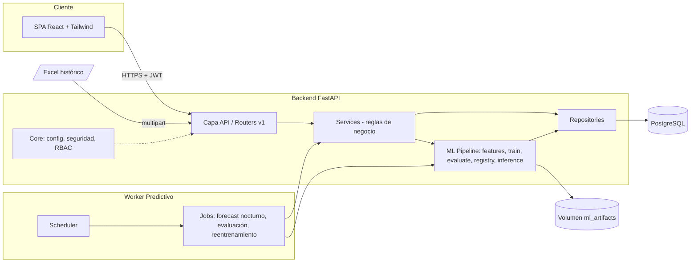
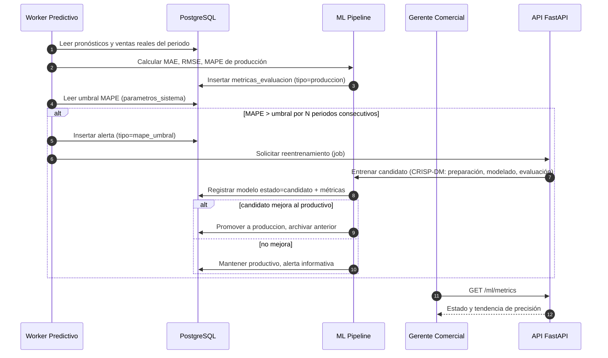
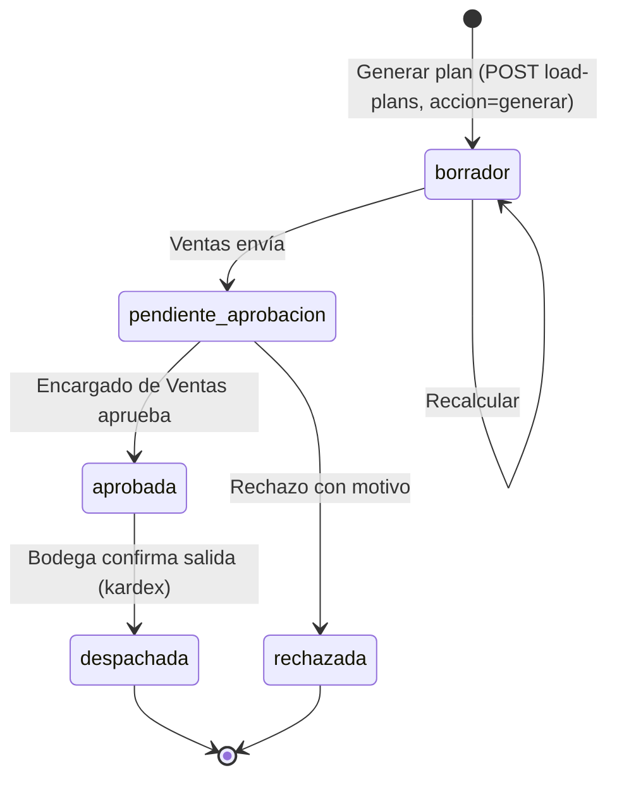

# Especificación Arquitectónica — Sistema de Análisis Predictivo (ML) para Desarrollos Comerciales del Sur, S.A.

> **Naturaleza del documento:** directiva de diseño (sin código de aplicación). Pensado como contexto de entrada para Claude CLI (`CLAUDE.md` / `docs/architecture/`).
> **Alcance:** prototipo funcional académico, 5 meses. **Stack:** PostgreSQL · FastAPI · Scikit-learn/XGBoost/TensorFlow-Keras · React + Tailwind.

---

## 0. Decisiones arquitectónicas transversales (ADR resumidas)

| ID | Decisión | Justificación |
|----|----------|---------------|
| ADR-01 | Monolito modular en capas (Clean Architecture) con Worker separado, no microservicios | Equipo de una persona y 5 meses; menor costo operativo y de depuración |
| ADR-02 | PostgreSQL como única fuente de verdad; artefactos ML serializados en disco (volumen) con hash y ruta registrados en `modelos_ml` | Evita BLOBs pesados en BD, mantiene trazabilidad y reproducibilidad |
| ADR-03 | Solo un modelo en estado `produccion` por (producto o familia, horizonte) | Inferencia determinista y rollback simple |
| ADR-04 | Reentrenamiento asíncrono vía tabla de jobs + Worker (sin broker externo en v1) | Reduce infraestructura; se puede migrar a Celery/Redis después |
| ADR-05 | RBAC por permisos granulares (`recurso:acción`) asignados a roles; JWT con `sub`, `roles`, `perms`, `exp` | Verificación sin consulta a BD en cada request |
| ADR-06 | La carga de ruta siempre pasa por estados `borrador → pendiente_aprobacion → aprobada/rechazada`; nunca se despacha automáticamente | El humano (Ventas) mantiene control; el modelo solo sugiere |
| ADR-07 | El límite de carga por stock disponible prevalece sobre la demanda predicha | Evita compromisos de entrega sin existencia |
| ADR-08 | Umbral de MAPE configurable en `parametros_sistema`; el Worker evalúa degradación y crea alerta + trigger | Reentrenamiento gobernado por datos, no manual |
| ADR-09 | El ETL acepta dos formatos y ambos se normalizan al mismo registro `(fecha, ruta, sku, cantidad, precio_unitario[, vendedor])`: **tabular** (plantilla del contrato) y **ancho** (Excel comercial real `VENTAS DIARIAS`: una hoja por vendedor/ruta, columnas `ventas DD`). En el formato ancho la hoja identifica la ruta (`rutas.codigo` o `rutas.nombre`), el producto se identifica por `productos.sku = "<medida>-<SABOR>"` normalizado (p. ej. `3030-PINA`) porque el Excel no trae SKU, y sin `hoja` se procesan todas las hojas con ese layout (el checksum es por archivo). `periodo` (YYYY-MM) se infiere del nombre del archivo o se envía como campo opcional | Los datos reales son anchos y sin SKU; cargar solo la primera hoja impediría cargar el resto del archivo por el checksum único |
| ADR-10 | Un lote `rechazado` no bloquea el reenvío del mismo archivo (se reutiliza su fila `etl_lotes`); solo `cargado`/`validado`/`recibido` devuelven 400 `LOTE_DUPLICADO`. Comisión = `monto_total × parametros_sistema['comisiones.porcentaje'] / 100` por venta con vendedor (recalculada por `ON CONFLICT`); si el parámetro no existe se carga sin comisiones y se advierte | Un rechazo por catálogo incompleto no debe volver inútil el archivo; el porcentaje no consta en los datos y lo define el negocio |

Extensiones aditivas al contrato de `POST /etl/upload-excel` (ADR-09/10): campo de formulario `periodo`; `EtlValidationError.total_errores` (los `errores` se truncan en 1000) y `ErrorFila.hoja`; códigos 400 `LOTE_DUPLICADO`, `ARCHIVO_INVALIDO`, `HOJA_NO_ENCONTRADA`, `PERIODO_NO_DETECTADO`, `PERIODO_INVALIDO`.

---

## 1. Diagramas conceptuales

### 1.1 Vista de componentes



### 1.2 Flujo de reentrenamiento por degradación



### 1.3 Máquina de estados de `cargas_ruta`



### 1.4 Matriz de actores y permisos (RBAC base)

| Permiso | Admin | Inventario | Ventas | Bodega | Compras | Gerente | Proveedor | Worker |
|---------|:----:|:----------:|:------:|:------:|:-------:|:-------:|:---------:|:------:|
| `usuarios:gestionar` | ✔ | | | | | | | |
| `etl:cargar` | ✔ | ✔ | ✔ | | | | | |
| `prediccion:consultar` | ✔ | ✔ | ✔ | | ✔ | ✔ | | ✔ |
| `carga_ruta:generar` | ✔ | | ✔ | | | | | |
| `carga_ruta:aprobar` | ✔ | | ✔ | | | ✔ | | |
| `carga_ruta:despachar` | | | | ✔ | | | | |
| `inventario:leer` | ✔ | ✔ | ✔ | ✔ | ✔ | ✔ | | |
| `inventario:ajustar` | ✔ | ✔ | | ✔ | | | | |
| `pedido_proveedor:gestionar` | ✔ | | | | ✔ | | | |
| `pedido_proveedor:confirmar` | | | | | | | ✔ | |
| `ml:metricas:leer` | ✔ | | | | | ✔ | | ✔ |
| `ml:reentrenar` | ✔ | | | | | ✔ | | ✔ |
| `alertas:leer` | ✔ | ✔ | ✔ | ✔ | ✔ | ✔ | | ✔ |

> El actor **Proveedor** accede únicamente a sus propios pedidos (restricción a nivel de fila por `proveedor_id` asociado a su usuario).

---

## 2. Mockup de arquitectura del proyecto (estructura de archivos)

```text
ds-predictive-platform/
├── CLAUDE.md                          # Directivas para Claude CLI (apunta a docs/architecture)
├── README.md
├── .env.example
├── .gitignore
├── Makefile                           # Atajos: up, down, migrate, seed, test, lint
│
├── docs/
│   └── architecture/
│       ├── 00-especificacion.md       # Este documento
│       ├── openapi.yaml               # Contrato formal (sección 4)
│       ├── er-diagram.mmd             # Diagrama ER (sección 3)
│       └── qa-matrix.md               # Matriz de pruebas (sección 5)
│
├── backend/
│   ├── Dockerfile
│   ├── pyproject.toml
│   ├── alembic.ini
│   ├── app/
│   │   ├── main.py                    # Ensamblado de la app y routers
│   │   ├── api/                       # CAPA 1 · Interfaz HTTP
│   │   │   ├── deps.py                # Dependencias: sesión BD, usuario actual, guardas RBAC
│   │   │   └── v1/
│   │   │       ├── router.py
│   │   │       ├── auth.py
│   │   │       ├── etl.py
│   │   │       ├── predictions.py
│   │   │       ├── routes.py          # load-plans
│   │   │       ├── ml.py              # metrics, retrain, models
│   │   │       ├── inventory.py
│   │   │       ├── purchasing.py
│   │   │       └── alerts.py
│   │   ├── schemas/                   # DTOs (Pydantic) de entrada/salida por módulo
│   │   ├── services/                  # CAPA 2 · Casos de uso / reglas de negocio
│   │   │   ├── auth_service.py
│   │   │   ├── etl_service.py         # Validación y depuración del Excel
│   │   │   ├── prediction_service.py
│   │   │   ├── load_plan_service.py   # Regla: min(demanda, stock disponible)
│   │   │   ├── model_governance_service.py  # Promoción, archivado, umbrales
│   │   │   ├── inventory_service.py
│   │   │   ├── purchasing_service.py
│   │   │   └── alert_service.py
│   │   ├── repositories/              # CAPA 3 · Acceso a datos (una por agregado)
│   │   │   ├── base.py
│   │   │   ├── user_repo.py
│   │   │   ├── product_repo.py
│   │   │   ├── sales_repo.py
│   │   │   ├── inventory_repo.py
│   │   │   ├── load_plan_repo.py
│   │   │   ├── model_repo.py
│   │   │   ├── metrics_repo.py
│   │   │   ├── forecast_repo.py
│   │   │   └── alert_repo.py
│   │   ├── domain/                    # Entidades ORM y enumeraciones de dominio
│   │   │   ├── models/                # Mapeo a tablas (una por módulo)
│   │   │   └── enums.py               # estados de carga, tipos de alerta, tipos de movimiento
│   │   ├── core/                      # CAPA transversal
│   │   │   ├── config.py              # Settings por variables de entorno
│   │   │   ├── security.py            # JWT, hashing de contraseñas
│   │   │   ├── rbac.py                # Catálogo de permisos y evaluación
│   │   │   ├── errors.py              # Excepciones de dominio → códigos HTTP
│   │   │   ├── logging.py
│   │   │   └── database.py            # Engine y sesión
│   │   ├── ml/                        # CAPA · ML Pipeline (CRISP-DM)
│   │   │   ├── contracts.py           # Interfaces: Forecaster, Evaluator, ArtifactStore
│   │   │   ├── data_understanding/    # Perfilado y calidad de datos
│   │   │   ├── data_preparation/
│   │   │   │   ├── cleaning.py
│   │   │   │   ├── feature_engineering.py   # lags, medias móviles, calendario, estacionalidad
│   │   │   │   └── splitters.py             # Split temporal / walk-forward
│   │   │   ├── modeling/
│   │   │   │   ├── sklearn_models.py        # Baselines (regresión, RandomForest)
│   │   │   │   ├── xgboost_models.py
│   │   │   │   ├── lstm_models.py           # Keras: demanda temporal
│   │   │   │   └── model_factory.py
│   │   │   ├── evaluation/
│   │   │   │   ├── metrics.py               # MAE, RMSE, MAPE (definición única)
│   │   │   │   └── backtesting.py
│   │   │   ├── registry/
│   │   │   │   ├── artifact_store.py        # Lectura/escritura en ml_artifacts
│   │   │   │   └── model_registry.py        # Sincroniza con modelos_ml
│   │   │   └── inference/
│   │   │       ├── predictor.py             # Carga de modelo productivo y predicción
│   │   │       └── cache.py                 # Caché en memoria del modelo activo
│   │   ├── workers/                   # Worker Predictivo (proceso separado)
│   │   │   ├── main.py                # Punto de entrada del worker
│   │   │   ├── scheduler.py           # Definición de cron jobs
│   │   │   └── jobs/
│   │   │       ├── nightly_forecast.py
│   │   │       ├── evaluate_production.py   # Calcula MAPE real vs. predicho
│   │   │       ├── retrain_model.py
│   │   │       └── stock_alerts.py
│   │   └── db/
│   │       ├── migrations/            # Alembic (versions/)
│   │       └── seeds/                 # Roles, permisos, parámetros, usuario admin inicial
│   └── tests/
│       ├── unit/                      # services, ml/metrics, rbac
│       ├── integration/               # API + BD de prueba
│       ├── ml/                        # Reproducibilidad y regresión de métricas
│       └── fixtures/                  # Excel válidos e inválidos de muestra
│
├── ml_artifacts/                      # Volumen persistente (fuera de control de versiones)
│   ├── models/
│   │   └── <algoritmo>/<version>/     # Ej. xgboost/v1.0.3/
│   │       ├── model.bin              # Serialización del modelo
│   │       ├── preprocessor.bin       # Scalers / encoders
│   │       ├── feature_schema.json    # Lista y orden de features
│   │       └── training_report.json   # Métricas, hiperparámetros, ventana de datos
│   └── reports/                       # Gráficos y reportes de evaluación
│
├── data/
│   ├── raw/                           # Excel originales recibidos (inmutables)
│   ├── staging/                       # Datos validados pendientes de carga a BD
│   ├── rejected/                      # Filas rechazadas con motivo
│   └── processed/                     # Datasets de entrenamiento versionados por fecha
│
├── frontend/
│   ├── Dockerfile
│   ├── package.json
│   ├── tailwind.config.js
│   ├── vite.config.ts
│   └── src/
│       ├── main.tsx
│       ├── app/
│       │   ├── routes.tsx             # Rutas protegidas por permiso
│       │   └── providers/             # Auth, tema, query client
│       ├── services/                  # Servicios API
│       │   ├── httpClient.ts          # Instancia con interceptor de JWT y 401
│       │   ├── authApi.ts
│       │   ├── etlApi.ts
│       │   ├── predictionsApi.ts
│       │   ├── loadPlansApi.ts
│       │   └── mlApi.ts
│       ├── hooks/
│       │   ├── useAuth.ts
│       │   ├── usePermissions.ts
│       │   ├── useDemandForecast.ts
│       │   ├── useLoadPlan.ts
│       │   └── useModelMetrics.ts
│       ├── views/
│       │   ├── LoginView.tsx
│       │   ├── SalesDashboardView.tsx        # Mockup 2a
│       │   ├── ModelMonitoringView.tsx       # Mockup 2b
│       │   ├── EtlUploadView.tsx
│       │   ├── InventoryView.tsx
│       │   ├── PurchasingView.tsx
│       │   └── AdminUsersView.tsx
│       ├── components/
│       │   ├── layout/                # Shell, Sidebar, Header
│       │   ├── charts/                # DemandChart, MapeTrendChart, ErrorBarChart
│       │   ├── tables/                # LoadPlanTable, ModelsTable
│       │   ├── feedback/              # AlertBanner, Toast, EmptyState
│       │   └── common/                # Button, Modal, PermissionGate
│       ├── types/                     # Tipos derivados del contrato OpenAPI
│       └── utils/
│
└── infra/
    ├── docker-compose.yml             # postgres, backend, worker, frontend
    ├── docker-compose.dev.yml         # Overrides con hot reload
    ├── postgres/
    │   └── init/                      # Extensiones y roles de BD
    ├── nginx/
    │   └── default.conf               # Proxy inverso SPA + /api
    └── env/
        ├── backend.env.example
        └── worker.env.example
```

**Servicios de orquestación (declarativo):**

```yaml
services:
  postgres:  { image: postgres:16, volumes: [pgdata], healthcheck: pg_isready }
  backend:   { build: ./backend, depends_on: [postgres], volumes: [ml_artifacts, data], ports: ["8000:8000"] }
  worker:    { build: ./backend, command: "worker entrypoint", depends_on: [postgres], volumes: [ml_artifacts, data] }
  frontend:  { build: ./frontend, ports: ["5173:80"], depends_on: [backend] }
volumes: [pgdata, ml_artifacts, data]
```

**Reglas de dependencia entre capas (obligatorias):**
1. `api → services → repositories → domain`; jamás en sentido inverso.
2. `services` puede invocar `ml/` solo a través de `ml/contracts.py`.
3. `ml/` no importa `api/` ni `services/`.
4. `workers/` invoca `services/` (no repositorios directamente).
5. El frontend consume únicamente los endpoints del contrato `openapi.yaml`.

---

## 2.1 Mockups visuales conceptuales (wireframes ASCII)

### 2a. Dashboard de Predicción de Demanda y Aprobación de Cargas de Ruta (vista de Ventas)

```text
┌──────────────────────────────────────────────────────────────────────────────────────────┐
│ DS Predictive  │  Dashboard de Ventas                     🔔 3 alertas   👤 M. Pérez ▾   │
├───────────────┬──────────────────────────────────────────────────────────────────────────┤
│ ▸ Dashboard   │  Filtros                                                                 │
│   Ventas      │  Ruta: [ R-04 Escuintla ▾ ]  Fecha operación: [ 2026-10-01 ]             │
│   Inventario  │  Horizonte: (•) 1 día  ( ) 7 días  ( ) 14 días   Categoría: [ Todas ▾ ] │
│   Compras     │  Modelo activo: xgboost v1.0.3  · MAPE 8.4% · Actualizado 2026-09-28     │
│   Carga ETL   │                                                             [ Consultar ]│
│   Monitoreo   ├───────────────────────────────┬──────────────────────────────────────────┤
│   Usuarios    │  KPIs                         │  Demanda predicha vs. histórica          │
│               │  ┌────────┐┌────────┐┌──────┐ │  u.                                      │
│               │  │Demanda ││Cobertura││Ítems │ │  600 │        ╭─╮        ····· real     │
│               │  │ total  ││ stock   ││en    │ │  400 │   ╭────╯ ╰──╮   ───── predicho   │
│               │  │ 1,240u ││  92%    ││riesgo│ │  200 │───╯         ╰── ░░░ banda 95%    │
│               │  │        ││         ││  4   │ │    0 └────────────────────────────▶ días│
│               │  └────────┘└────────┘└──────┘ │                                          │
│               ├───────────────────────────────┴──────────────────────────────────────────┤
│               │  Plan de carga sugerido  · Estado: [BORRADOR]                            │
│               │ ┌───┬───────────┬────────────┬──────────┬───────────┬──────────┬────────┐│
│               │ │ ☐ │ SKU       │ Producto   │ Demanda  │ Stock     │ Sugerido │Aprobado││
│               │ │   │           │            │ predicha │ disponible│          │ (edit) ││
│               │ ├───┼───────────┼────────────┼──────────┼───────────┼──────────┼────────┤│
│               │ │ ☑ │ BEB-0012  │ Agua 600ml │   320    │   500     │   320    │ [320 ] ││
│               │ │ ☑ │ BEB-0034  │ Gaseosa 2L │   210    │   150     │ 150 ⚠    │ [150 ] ││
│               │ │ ☑ │ SNK-0007  │ Galleta    │   180    │   400     │   180    │ [180 ] ││
│               │ │ ☐ │ LIM-0003  │ Detergente │    60    │     0 ⛔  │    0     │ [ 0  ] ││
│               │ └───┴───────────┴────────────┴──────────┴───────────┴──────────┴────────┘│
│               │  ⚠ Limitado por stock   ⛔ Sin existencia (ver alerta de compras)         │
│               │  Observaciones: [__________________________________________]            │
│               │                                                                          │
│               │  [ Recalcular ]   [ Rechazar ]   [ Enviar a aprobación ]  [ ✔ Aprobar ]  │
└───────────────┴──────────────────────────────────────────────────────────────────────────┘
Reglas de UI:
 - "Aprobar" visible solo con permiso carga_ruta:aprobar; deshabilitado si no hay filas seleccionadas.
 - Cantidad aprobada editable pero nunca mayor que stock disponible (validación en cliente y servidor).
 - Fila con ⚠/⛔ muestra tooltip con demanda original vs. cantidad ajustada.
```

### 2b. Panel de Monitoreo de Precisión de Modelos

```text
┌──────────────────────────────────────────────────────────────────────────────────────────┐
│ DS Predictive  │  Monitoreo de Modelos ML                  🔔 1 crítica   👤 Gerente ▾  │
├───────────────┬──────────────────────────────────────────────────────────────────────────┤
│ ▸ Dashboard   │  Modelo en producción: [ xgboost v1.0.3 ▾ ]   Periodo: [ Últimos 90 d ▾ ]│
│   Monitoreo   ├──────────────┬──────────────┬──────────────┬─────────────────────────────┤
│   Modelos     │  MAE         │  RMSE        │  MAPE        │  Estado de degradación      │
│   Alertas     │  12.4 u      │  18.9 u      │  13.2 % 🔴   │  Umbral MAPE: 12.0 %        │
│               │  ▼ 0.6 vs.   │  ▲ 1.2 vs.   │  ▲ 4.8 pts   │  Periodos consecutivos      │
│               │  periodo ant.│  periodo ant.│  vs. inicio  │  sobre umbral: 2 de 3       │
│               ├──────────────┴──────────────┴──────────────┴─────────────────────────────┤
│               │  Evolución de MAPE                                                       │
│               │  % │                                     ╭── 13.2                      │
│               │ 14 │                              ╭──────╯                             │
│               │ 12 │- - - - - - - - - - - - - - - - - - - - - - -  umbral                │
│               │ 10 │────────╮   ╭────╯                                                  │
│               │  8 │        ╰───╯                                                       │
│               │    └───────────────────────────────────────────────▶ semanas            │
│               ├──────────────────────────────────────────────────────────────────────────┤
│               │  Precisión por categoría / producto (top peor desempeño)                 │
│               │ ┌────────────┬──────┬──────┬────────┬────────────────────────────┐      │
│               │ │ Producto   │ MAE  │ RMSE │ MAPE   │ Tendencia                  │      │
│               │ ├────────────┼──────┼──────┼────────┼────────────────────────────┤      │
│               │ │ Gaseosa 2L │ 21.0 │ 30.2 │ 19.8 % │ ▲▲▲                        │      │
│               │ │ Agua 600ml │  9.1 │ 12.4 │  7.5 % │ ▬▬                         │      │
│               │ └────────────┴──────┴──────┴────────┴────────────────────────────┘      │
│               ├──────────────────────────────────────────────────────────────────────────┤
│               │  Trigger de reentrenamiento                                              │
│               │  Umbral MAPE: [ 12.0 ] %   Periodos consecutivos: [ 3 ]                  │
│               │  Algoritmos candidatos: ☑ XGBoost  ☑ LSTM  ☐ RandomForest                │
│               │  Ventana de datos: [ 2023-01-01 ] a [ hoy ]                              │
│               │  Último reentrenamiento: 2026-08-14 (candidato descartado)               │
│               │                     [ Guardar umbral ]   [ ⟳ Reentrenar ahora ]         │
│               ├──────────────────────────────────────────────────────────────────────────┤
│               │  Historial de modelos: v1.0.3 ▶PROD │ v1.0.2 archivado │ v1.1.0-cand    │
└───────────────┴──────────────────────────────────────────────────────────────────────────┘
Reglas de UI:
 - Indicador 🟢 (MAPE ≤ umbral·0.8), 🟡 (≤ umbral), 🔴 (> umbral).
 - "Reentrenar ahora" requiere permiso ml:reentrenar y confirmación modal; retorna job_id y muestra progreso.
```

---

## 3. Diseño físico de base de datos (PostgreSQL 16)

### 3.1 Convenciones

- Claves primarias `uuid` (`gen_random_uuid()`) para entidades de negocio; `bigint GENERATED ALWAYS AS IDENTITY` para tablas de alto volumen (`kardex`, `ventas_historicas`, `pronosticos_demanda`).
- Todas las marcas de tiempo son `timestamptz` en UTC; fechas de negocio son `date`.
- Montos: `numeric(14,2)`; cantidades: `numeric(12,2)`; porcentajes de error: `numeric(7,3)`.
- Estados y tipos se implementan como `varchar` con `CHECK` (más simple de migrar que `ENUM` nativo).
- Auditoría mínima: `creado_en`, `actualizado_en` en tablas transaccionales.
- El diagrama omite precisión numérica (limitación de sintaxis Mermaid); la precisión está definida arriba y en el diccionario.

### 3.2 Diagrama Entidad-Relación

```mermaid
erDiagram
    usuarios ||--o{ usuarios_roles : "tiene"
    roles ||--o{ usuarios_roles : "asignado_a"
    roles ||--o{ roles_permisos : "otorga"
    permisos ||--o{ roles_permisos : "incluido_en"

    categorias ||--o{ categorias : "subcategoria_de"
    categorias ||--o{ productos : "clasifica"
    proveedores ||--o{ productos : "suministra"
    proveedores ||--o{ usuarios : "cuenta_de_acceso"
    usuarios ||--o{ rutas : "vendedor_asignado"

    productos ||--|| inventario : "existencia"
    productos ||--o{ kardex : "movimientos"
    usuarios ||--o{ kardex : "registra"

    rutas ||--o{ cargas_ruta : "planifica"
    usuarios ||--o{ cargas_ruta : "genera_aprueba"
    modelos_ml ||--o{ cargas_ruta : "sugiere_con"
    cargas_ruta ||--|{ detalle_cargas : "contiene"
    productos ||--o{ detalle_cargas : "incluido"

    proveedores ||--o{ pedidos_proveedor : "recibe"
    usuarios ||--o{ pedidos_proveedor : "crea"
    pedidos_proveedor ||--|{ detalle_pedidos : "contiene"
    productos ||--o{ detalle_pedidos : "solicitado"
    alertas |o--o{ detalle_pedidos : "origina"

    usuarios ||--o{ etl_lotes : "carga"
    etl_lotes ||--o{ ventas_historicas : "origina"
    productos ||--o{ ventas_historicas : "vendido"
    rutas ||--o{ ventas_historicas : "en_ruta"
    usuarios ||--o{ ventas_historicas : "vendedor"
    usuarios ||--o{ comisiones : "devenga"
    ventas_historicas ||--o{ comisiones : "genera"

    modelos_ml ||--o{ metricas_evaluacion : "evaluado_con"
    modelos_ml ||--o{ pronosticos_demanda : "produce"
    productos ||--o{ pronosticos_demanda : "pronosticado"
    rutas ||--o{ pronosticos_demanda : "para_ruta"
    modelos_ml ||--o{ alertas : "dispara"
    productos ||--o{ alertas : "afecta"

    usuarios {
        uuid id PK
        varchar email UK
        varchar password_hash
        varchar nombre_completo
        uuid proveedor_id FK "nullable, solo rol Proveedor"
        boolean activo
        timestamptz ultimo_login
        timestamptz creado_en
        timestamptz actualizado_en
    }
    roles {
        smallint id PK
        varchar nombre UK
        varchar descripcion
    }
    permisos {
        smallint id PK
        varchar codigo UK "recurso:accion"
        varchar descripcion
    }
    roles_permisos {
        smallint rol_id PK, FK
        smallint permiso_id PK, FK
    }
    usuarios_roles {
        uuid usuario_id PK, FK
        smallint rol_id PK, FK
        timestamptz asignado_en
    }

    categorias {
        uuid id PK
        varchar nombre UK
        uuid categoria_padre_id FK "nullable"
    }
    proveedores {
        uuid id PK
        varchar nombre
        varchar nit UK
        varchar email
        integer lead_time_dias
        boolean activo
    }
    productos {
        uuid id PK
        varchar sku UK
        varchar nombre
        uuid categoria_id FK
        uuid proveedor_id FK
        varchar unidad_medida
        numeric precio_venta
        numeric costo_unitario
        numeric stock_minimo
        boolean activo
        timestamptz creado_en
    }
    rutas {
        uuid id PK
        varchar codigo UK
        varchar nombre
        varchar zona
        uuid vendedor_id FK "nullable"
        boolean activa
    }

    inventario {
        uuid id PK
        uuid producto_id FK "UK"
        numeric stock_actual
        numeric stock_reservado
        timestamptz actualizado_en
    }
    kardex {
        bigint id PK
        uuid producto_id FK
        varchar tipo_movimiento "entrada|salida|ajuste|reserva|liberacion"
        numeric cantidad
        numeric saldo_resultante
        varchar referencia_tipo "carga_ruta|pedido|ajuste|etl"
        uuid referencia_id
        uuid usuario_id FK
        timestamptz fecha_movimiento
    }
    cargas_ruta {
        uuid id PK
        uuid ruta_id FK
        date fecha_operacion
        varchar estado "borrador|pendiente_aprobacion|aprobada|rechazada|despachada"
        uuid modelo_id FK
        uuid generado_por FK
        uuid aprobado_por FK "nullable"
        text observaciones
        timestamptz generada_en
        timestamptz aprobada_en
    }
    detalle_cargas {
        uuid id PK
        uuid carga_id FK
        uuid producto_id FK
        numeric cantidad_predicha
        numeric stock_disponible_al_generar
        numeric cantidad_sugerida
        numeric cantidad_aprobada
        boolean ajustado_por_stock
    }
    pedidos_proveedor {
        uuid id PK
        uuid proveedor_id FK
        uuid creado_por FK
        varchar estado "borrador|enviado|confirmado|recibido|cancelado"
        date fecha_pedido
        date fecha_esperada
        numeric total
    }
    detalle_pedidos {
        uuid id PK
        uuid pedido_id FK
        uuid producto_id FK
        uuid alerta_origen_id FK "nullable"
        numeric cantidad
        numeric costo_unitario
    }

    etl_lotes {
        uuid id PK
        uuid usuario_id FK
        varchar archivo_nombre
        char checksum_sha256 UK
        varchar estado "recibido|validado|rechazado|cargado"
        integer filas_totales
        integer filas_validas
        integer filas_rechazadas
        jsonb errores
        timestamptz creado_en
    }
    ventas_historicas {
        bigint id PK
        uuid lote_id FK
        date fecha_venta
        uuid producto_id FK
        uuid ruta_id FK
        uuid vendedor_id FK "nullable"
        numeric cantidad
        numeric precio_unitario
        numeric monto_total
    }
    comisiones {
        uuid id PK
        uuid vendedor_id FK
        bigint venta_id FK
        char periodo "YYYY-MM"
        numeric porcentaje
        numeric monto
    }

    modelos_ml {
        uuid id PK
        varchar nombre
        varchar algoritmo "sklearn|xgboost|lstm"
        varchar version
        varchar estado "candidato|produccion|archivado|descartado"
        varchar ruta_artefacto
        char hash_artefacto
        jsonb hiperparametros
        jsonb esquema_features
        date ventana_desde
        date ventana_hasta
        varchar motivo_entrenamiento "programado|manual|degradacion"
        uuid entrenado_por FK "nullable si Worker"
        timestamptz entrenado_en
        timestamptz promovido_en
    }
    metricas_evaluacion {
        uuid id PK
        uuid modelo_id FK
        uuid producto_id FK "nullable=global"
        varchar tipo_evaluacion "holdout|backtest|produccion"
        numeric mae
        numeric rmse
        numeric mape
        integer n_muestras
        date periodo_desde
        date periodo_hasta
        boolean supera_umbral
        timestamptz evaluado_en
    }
    pronosticos_demanda {
        bigint id PK
        uuid modelo_id FK
        uuid producto_id FK
        uuid ruta_id FK "nullable"
        date fecha_objetivo
        integer horizonte_dias
        numeric demanda_predicha
        numeric limite_inferior
        numeric limite_superior
        numeric demanda_real "nullable, se completa a posteriori"
        timestamptz generado_en
    }
    alertas {
        uuid id PK
        varchar tipo "stock_bajo|quiebre_proyectado|mape_umbral|etl_error"
        varchar severidad "info|advertencia|critica"
        uuid producto_id FK "nullable"
        uuid modelo_id FK "nullable"
        text mensaje
        varchar estado "abierta|reconocida|resuelta"
        timestamptz creada_en
        timestamptz resuelta_en
    }
```



> Tablas de soporte adicionales (no dibujadas para no sobrecargar el ER): `parametros_sistema(clave PK, valor jsonb, actualizado_por FK, actualizado_en)` para umbrales como `ml.mape_umbral`, `ml.periodos_consecutivos`; y `jobs_ml(id uuid PK, tipo, estado, parametros jsonb, solicitado_por FK, resultado_modelo_id FK, iniciado_en, finalizado_en, error text)` para el seguimiento de reentrenamientos asíncronos.

### 3.3 Restricciones e índices obligatorios

| Tabla | Restricción / Índice | Propósito |
|-------|----------------------|-----------|
| `ventas_historicas` | `UNIQUE (fecha_venta, producto_id, ruta_id, vendedor_id)` con `ON CONFLICT` en ETL | Idempotencia de re-cargas |
| `ventas_historicas` | Índice `(producto_id, fecha_venta)` y `(ruta_id, fecha_venta)` | Series temporales por producto/ruta |
| `ventas_historicas` | `CHECK (cantidad >= 0 AND precio_unitario >= 0)` | Calidad de datos |
| `inventario` | `CHECK (stock_actual >= 0 AND stock_reservado <= stock_actual)` | Integridad de existencias |
| `kardex` | Índice `(producto_id, fecha_movimiento DESC)` | Consulta de historial |
| `cargas_ruta` | `UNIQUE (ruta_id, fecha_operacion) WHERE estado IN ('borrador','pendiente_aprobacion','aprobada')` | Una carga vigente por ruta/día |
| `detalle_cargas` | `CHECK (cantidad_aprobada <= stock_disponible_al_generar)` | Regla ADR-07 |
| `modelos_ml` | `UNIQUE (nombre, version)`; índice parcial único `(nombre) WHERE estado='produccion'` | ADR-03 |
| `metricas_evaluacion` | Índice `(modelo_id, tipo_evaluacion, periodo_hasta DESC)` | Serie de degradación |
| `pronosticos_demanda` | `UNIQUE (modelo_id, producto_id, ruta_id, fecha_objetivo, horizonte_dias)`; índice `(fecha_objetivo, producto_id)` | Evita duplicados; cruce con ventas reales |
| `etl_lotes` | `UNIQUE (checksum_sha256)` | Bloquea carga duplicada del mismo archivo |
| `alertas` | Índice `(estado, severidad, creada_en DESC)` | Bandeja de alertas |

### 3.4 Diccionario de datos — tablas core de ML

#### 3.4.1 `modelos_ml` (registro y versionado de modelos)

| Columna | Tipo | Constraints | Justificación arquitectónica |
|---------|------|-------------|------------------------------|
| `id` | `uuid` | PK, default `gen_random_uuid()` | Identificador estable referenciado por pronósticos, métricas y cargas |
| `nombre` | `varchar(80)` | NOT NULL | Familia lógica del modelo (ej. `demanda_diaria`) |
| `algoritmo` | `varchar(20)` | NOT NULL, CHECK IN (`sklearn`,`xgboost`,`lstm`) | Selecciona el loader de artefactos en `model_factory` |
| `version` | `varchar(20)` | NOT NULL, UNIQUE con `nombre` | Versionado semántico; permite rollback |
| `estado` | `varchar(15)` | NOT NULL, CHECK IN (`candidato`,`produccion`,`archivado`,`descartado`) | Gobernanza del ciclo de vida (ADR-03) |
| `ruta_artefacto` | `varchar(255)` | NOT NULL | Ubicación relativa en `ml_artifacts/models/...` |
| `hash_artefacto` | `char(64)` | NOT NULL | SHA-256 para verificar integridad antes de cargar |
| `hiperparametros` | `jsonb` | NOT NULL | Reproducibilidad del entrenamiento |
| `esquema_features` | `jsonb` | NOT NULL | Orden/nombre de features; evita desalineación train/inferencia |
| `ventana_desde` / `ventana_hasta` | `date` | NOT NULL, CHECK `desde < hasta` | Trazabilidad de los datos usados (CRISP-DM: data understanding) |
| `motivo_entrenamiento` | `varchar(15)` | NOT NULL, CHECK IN (`programado`,`manual`,`degradacion`) | Auditoría de por qué se reentrenó |
| `entrenado_por` | `uuid` | FK → `usuarios.id`, NULL si lo hizo el Worker | Responsabilidad del disparo manual |
| `entrenado_en` | `timestamptz` | NOT NULL, default `now()` | Línea de tiempo del modelo |
| `promovido_en` | `timestamptz` | NULL | Momento de paso a producción |

#### 3.4.2 `metricas_evaluacion`

| Columna | Tipo | Constraints | Justificación arquitectónica |
|---------|------|-------------|------------------------------|
| `id` | `uuid` | PK | Identidad de cada medición |
| `modelo_id` | `uuid` | FK → `modelos_ml.id`, NOT NULL, ON DELETE RESTRICT | Vincula métrica a versión exacta |
| `producto_id` | `uuid` | FK → `productos.id`, NULL = métrica global | Permite diagnosticar productos con peor desempeño |
| `tipo_evaluacion` | `varchar(12)` | NOT NULL, CHECK IN (`holdout`,`backtest`,`produccion`) | Separa métricas offline de degradación real observada |
| `mae` | `numeric(12,4)` | NOT NULL, CHECK `>= 0` | Error absoluto medio (unidades) |
| `rmse` | `numeric(12,4)` | NOT NULL, CHECK `>= 0` | Penaliza errores grandes |
| `mape` | `numeric(7,3)` | NULL si demanda real = 0 en todo el periodo | Métrica del trigger; NULL evita división por cero silenciosa |
| `n_muestras` | `integer` | NOT NULL, CHECK `> 0` | Peso estadístico de la medición |
| `periodo_desde` / `periodo_hasta` | `date` | NOT NULL | Ventana evaluada |
| `supera_umbral` | `boolean` | NOT NULL, default `false` | Materializa la decisión para consultas rápidas del panel |
| `evaluado_en` | `timestamptz` | NOT NULL, default `now()` | Serie temporal de degradación |

#### 3.4.3 `pronosticos_demanda`

| Columna | Tipo | Constraints | Justificación arquitectónica |
|---------|------|-------------|------------------------------|
| `id` | `bigint` | PK identity | Alto volumen (producto × ruta × día × horizonte) |
| `modelo_id` | `uuid` | FK, NOT NULL | Atribución del pronóstico al modelo que lo emitió |
| `producto_id` | `uuid` | FK, NOT NULL | Granularidad de inferencia |
| `ruta_id` | `uuid` | FK, NULL = demanda agregada | Soporta predicción por ruta o total |
| `fecha_objetivo` | `date` | NOT NULL | Día pronosticado |
| `horizonte_dias` | `integer` | NOT NULL, CHECK `BETWEEN 1 AND 30` | Distancia al día base; el error crece con el horizonte |
| `demanda_predicha` | `numeric(12,2)` | NOT NULL, CHECK `>= 0` | Valor puntual usado por `load_plan_service` |
| `limite_inferior` / `limite_superior` | `numeric(12,2)` | CHECK `inferior <= predicha <= superior` | Intervalo de incertidumbre para el usuario de Ventas |
| `demanda_real` | `numeric(12,2)` | NULL hasta cierre del día | Habilita el cálculo de MAE/RMSE/MAPE de producción sin re-consultar ventas |
| `generado_en` | `timestamptz` | NOT NULL, default `now()` | Trazabilidad; evita usar pronósticos obsoletos |

#### 3.4.4 `alertas`

| Columna | Tipo | Constraints | Justificación arquitectónica |
|---------|------|-------------|------------------------------|
| `id` | `uuid` | PK | Identidad |
| `tipo` | `varchar(25)` | NOT NULL, CHECK IN (`stock_bajo`,`quiebre_proyectado`,`mape_umbral`,`etl_error`) | Enrutamiento por rol destinatario |
| `severidad` | `varchar(12)` | NOT NULL, CHECK IN (`info`,`advertencia`,`critica`) | Prioriza la bandeja |
| `producto_id` / `modelo_id` | `uuid` | FK, NULLABLE | Contexto de la alerta (uno u otro según `tipo`) |
| `mensaje` | `text` | NOT NULL | Texto mostrado al usuario |
| `estado` | `varchar(12)` | NOT NULL, default `abierta` | Ciclo de atención |
| `creada_en` / `resuelta_en` | `timestamptz` | NOT NULL / NULL | Medición de tiempos de respuesta |

---

## 4. Contrato de interfaz formal (OpenAPI 3.0.3)

> Guardar como `docs/architecture/openapi.yaml`. Es la fuente de verdad: el backend debe cumplirlo y los tipos del frontend se derivan de él.

```yaml
openapi: 3.0.3
info:
  title: API Análisis Predictivo — Desarrollos Comerciales del Sur, S.A.
  version: 1.0.0
  description: Contrato del prototipo de tesis. Autenticación JWT y control de acceso RBAC.
servers:
  - url: http://localhost:8000
    description: Desarrollo local
tags:
  - name: Auth
  - name: ETL
  - name: Predictions
  - name: Routes
  - name: ML

security:
  - bearerAuth: []

paths:
  /api/v1/auth/login:
    post:
      tags: [Auth]
      summary: Autenticación y emisión de JWT
      operationId: login
      security: []
      requestBody:
        required: true
        content:
          application/json:
            schema: { $ref: '#/components/schemas/LoginRequest' }
      responses:
        '200':
          description: Autenticación exitosa
          content:
            application/json:
              schema: { $ref: '#/components/schemas/TokenResponse' }
        '400': { $ref: '#/components/responses/BadRequest' }
        '401': { $ref: '#/components/responses/Unauthorized' }
        '422': { $ref: '#/components/responses/ValidationError' }
        '500': { $ref: '#/components/responses/InternalError' }

  /api/v1/etl/upload-excel:
    post:
      tags: [ETL]
      summary: Ingesta de histórico de ventas desde Excel
      description: >
        Requiere permiso `etl:cargar`. Valida estructura, tipos y reglas de negocio.
        Si existen errores bloqueantes el lote se rechaza completo (modo estricto)
        salvo `modo=parcial`. Un archivo con checksum ya cargado devuelve 400.
      operationId: uploadExcel
      requestBody:
        required: true
        content:
          multipart/form-data:
            schema:
              type: object
              required: [file]
              properties:
                file:
                  type: string
                  format: binary
                  description: Archivo .xlsx (máx. 20 MB)
                modo:
                  type: string
                  enum: [estricto, parcial]
                  default: estricto
                hoja:
                  type: string
                  description: Nombre de la hoja; por defecto la primera
      responses:
        '200':
          description: Lote procesado
          content:
            application/json:
              schema: { $ref: '#/components/schemas/EtlResult' }
        '400': { $ref: '#/components/responses/BadRequest' }
        '401': { $ref: '#/components/responses/Unauthorized' }
        '403': { $ref: '#/components/responses/Forbidden' }
        '422':
          description: El archivo no cumple validaciones estructurales o de datos
          content:
            application/json:
              schema: { $ref: '#/components/schemas/EtlValidationError' }
        '500': { $ref: '#/components/responses/InternalError' }

  /api/v1/predictions/demand:
    post:
      tags: [Predictions]
      summary: Inferencia de demanda por producto/ruta/horizonte
      description: Requiere permiso `prediccion:consultar`. Usa el modelo en estado `produccion`.
      operationId: predictDemand
      requestBody:
        required: true
        content:
          application/json:
            schema: { $ref: '#/components/schemas/DemandRequest' }
      responses:
        '200':
          description: Pronóstico generado
          content:
            application/json:
              schema: { $ref: '#/components/schemas/DemandResponse' }
        '400': { $ref: '#/components/responses/BadRequest' }
        '401': { $ref: '#/components/responses/Unauthorized' }
        '403': { $ref: '#/components/responses/Forbidden' }
        '422': { $ref: '#/components/responses/ValidationError' }
        '500': { $ref: '#/components/responses/InternalError' }

  /api/v1/routes/load-plans:
    post:
      tags: [Routes]
      summary: Generación y aprobación de carga de ruta
      description: >
        `accion=generar` crea un plan en borrador aplicando cantidad_sugerida = min(demanda, stock disponible).
        `accion=aprobar|rechazar` opera sobre un plan existente (`carga_id` obligatorio).
        Generar requiere `carga_ruta:generar`; aprobar/rechazar requiere `carga_ruta:aprobar`.
      operationId: manageLoadPlan
      requestBody:
        required: true
        content:
          application/json:
            schema: { $ref: '#/components/schemas/LoadPlanRequest' }
      responses:
        '200':
          description: Operación aplicada
          content:
            application/json:
              schema: { $ref: '#/components/schemas/LoadPlanResponse' }
        '400': { $ref: '#/components/responses/BadRequest' }
        '401': { $ref: '#/components/responses/Unauthorized' }
        '403': { $ref: '#/components/responses/Forbidden' }
        '422': { $ref: '#/components/responses/ValidationError' }
        '500': { $ref: '#/components/responses/InternalError' }

  /api/v1/ml/metrics:
    get:
      tags: [ML]
      summary: Consulta de precisión y degradación
      description: Requiere permiso `ml:metricas:leer`.
      operationId: getMlMetrics
      parameters:
        - name: modelo_id
          in: query
          required: false
          schema: { type: string, format: uuid }
          description: Si se omite, se usa el modelo en producción
        - name: tipo_evaluacion
          in: query
          schema: { type: string, enum: [holdout, backtest, produccion], default: produccion }
        - name: desde
          in: query
          required: true
          schema: { type: string, format: date }
        - name: hasta
          in: query
          required: true
          schema: { type: string, format: date }
        - name: producto_id
          in: query
          schema: { type: string, format: uuid }
      responses:
        '200':
          description: Métricas y estado de degradación
          content:
            application/json:
              schema: { $ref: '#/components/schemas/MetricsResponse' }
        '400': { $ref: '#/components/responses/BadRequest' }
        '401': { $ref: '#/components/responses/Unauthorized' }
        '403': { $ref: '#/components/responses/Forbidden' }
        '422': { $ref: '#/components/responses/ValidationError' }
        '500': { $ref: '#/components/responses/InternalError' }

  /api/v1/ml/models/retrain:
    post:
      tags: [ML]
      summary: Disparo de reentrenamiento
      description: >
        Requiere permiso `ml:reentrenar`. Crea un job asíncrono; responde 200 con `job_id`
        y estado `en_cola`. El candidato solo se promueve si mejora al modelo en producción.
      operationId: retrainModel
      requestBody:
        required: true
        content:
          application/json:
            schema: { $ref: '#/components/schemas/RetrainRequest' }
      responses:
        '200':
          description: Job de reentrenamiento aceptado
          content:
            application/json:
              schema: { $ref: '#/components/schemas/RetrainResponse' }
        '400': { $ref: '#/components/responses/BadRequest' }
        '401': { $ref: '#/components/responses/Unauthorized' }
        '403': { $ref: '#/components/responses/Forbidden' }
        '422': { $ref: '#/components/responses/ValidationError' }
        '500': { $ref: '#/components/responses/InternalError' }

components:
  securitySchemes:
    bearerAuth:
      type: http
      scheme: bearer
      bearerFormat: JWT

  responses:
    BadRequest:
      description: Solicitud inválida a nivel de negocio (400)
      content:
        application/json:
          schema: { $ref: '#/components/schemas/Error' }
    Unauthorized:
      description: Token ausente, inválido o expirado (401)
      content:
        application/json:
          schema: { $ref: '#/components/schemas/Error' }
    Forbidden:
      description: Autenticado sin el permiso requerido (403)
      content:
        application/json:
          schema: { $ref: '#/components/schemas/Error' }
    ValidationError:
      description: Error de validación de esquema (422)
      content:
        application/json:
          schema: { $ref: '#/components/schemas/ValidationErrorBody' }
    InternalError:
      description: Error interno del servidor (500)
      content:
        application/json:
          schema: { $ref: '#/components/schemas/Error' }

  schemas:
    Error:
      type: object
      required: [codigo, mensaje]
      properties:
        codigo: { type: string, example: STOCK_INSUFICIENTE }
        mensaje: { type: string }
        detalle: { type: object, additionalProperties: true }
        request_id: { type: string }

    ValidationErrorBody:
      type: object
      required: [codigo, errores]
      properties:
        codigo: { type: string, example: VALIDACION_FALLIDA }
        errores:
          type: array
          items:
            type: object
            required: [campo, mensaje]
            properties:
              campo: { type: string }
              mensaje: { type: string }

    LoginRequest:
      type: object
      required: [email, password]
      properties:
        email: { type: string, format: email }
        password: { type: string, format: password, minLength: 8 }

    TokenResponse:
      type: object
      required: [access_token, token_type, expires_in, usuario]
      properties:
        access_token: { type: string }
        token_type: { type: string, enum: [bearer] }
        expires_in: { type: integer, description: Segundos de vigencia }
        usuario:
          type: object
          required: [id, nombre_completo, roles, permisos]
          properties:
            id: { type: string, format: uuid }
            nombre_completo: { type: string }
            roles: { type: array, items: { type: string } }
            permisos: { type: array, items: { type: string } }

    EtlResult:
      type: object
      required: [lote_id, estado, filas_totales, filas_validas, filas_rechazadas]
      properties:
        lote_id: { type: string, format: uuid }
        estado: { type: string, enum: [cargado, rechazado] }
        filas_totales: { type: integer }
        filas_validas: { type: integer }
        filas_rechazadas: { type: integer }
        rango_fechas:
          type: object
          properties:
            desde: { type: string, format: date }
            hasta: { type: string, format: date }
        advertencias: { type: array, items: { type: string } }

    EtlValidationError:
      type: object
      required: [codigo, lote_id, errores]
      properties:
        codigo: { type: string, enum: [COLUMNAS_FALTANTES, TIPOS_INVALIDOS, DATOS_INVALIDOS] }
        lote_id: { type: string, format: uuid }
        errores:
          type: array
          items:
            type: object
            required: [fila, columna, mensaje]
            properties:
              fila: { type: integer }
              columna: { type: string }
              valor: { type: string }
              mensaje: { type: string }

    DemandRequest:
      type: object
      required: [producto_ids, horizonte_dias]
      properties:
        producto_ids:
          type: array
          minItems: 1
          maxItems: 200
          items: { type: string, format: uuid }
        ruta_id: { type: string, format: uuid, nullable: true }
        fecha_base: { type: string, format: date, description: Por defecto hoy }
        horizonte_dias: { type: integer, minimum: 1, maximum: 30 }
        incluir_intervalo: { type: boolean, default: true }

    DemandPoint:
      type: object
      required: [fecha_objetivo, demanda_predicha]
      properties:
        fecha_objetivo: { type: string, format: date }
        demanda_predicha: { type: number }
        limite_inferior: { type: number }
        limite_superior: { type: number }

    DemandResponse:
      type: object
      required: [modelo, pronosticos]
      properties:
        modelo:
          type: object
          required: [id, algoritmo, version]
          properties:
            id: { type: string, format: uuid }
            algoritmo: { type: string }
            version: { type: string }
        generado_en: { type: string, format: date-time }
        pronosticos:
          type: array
          items:
            type: object
            required: [producto_id, serie]
            properties:
              producto_id: { type: string, format: uuid }
              serie: { type: array, items: { $ref: '#/components/schemas/DemandPoint' } }

    LoadPlanRequest:
      type: object
      required: [accion]
      properties:
        accion: { type: string, enum: [generar, aprobar, rechazar] }
        ruta_id: { type: string, format: uuid, description: "Obligatorio si accion=generar" }
        fecha_operacion: { type: string, format: date, description: "Obligatorio si accion=generar" }
        carga_id: { type: string, format: uuid, description: "Obligatorio si accion=aprobar|rechazar" }
        ajustes:
          type: array
          description: Cantidades aprobadas editadas (solo accion=aprobar)
          items:
            type: object
            required: [producto_id, cantidad_aprobada]
            properties:
              producto_id: { type: string, format: uuid }
              cantidad_aprobada: { type: number, minimum: 0 }
        motivo_rechazo: { type: string, description: "Obligatorio si accion=rechazar" }
        observaciones: { type: string }

    LoadPlanItem:
      type: object
      required: [producto_id, cantidad_predicha, stock_disponible, cantidad_sugerida, cantidad_aprobada, ajustado_por_stock]
      properties:
        producto_id: { type: string, format: uuid }
        sku: { type: string }
        cantidad_predicha: { type: number }
        stock_disponible: { type: number }
        cantidad_sugerida: { type: number }
        cantidad_aprobada: { type: number }
        ajustado_por_stock: { type: boolean }

    LoadPlanResponse:
      type: object
      required: [carga_id, estado, items]
      properties:
        carga_id: { type: string, format: uuid }
        ruta_id: { type: string, format: uuid }
        fecha_operacion: { type: string, format: date }
        estado: { type: string, enum: [borrador, pendiente_aprobacion, aprobada, rechazada, despachada] }
        modelo_id: { type: string, format: uuid }
        items: { type: array, items: { $ref: '#/components/schemas/LoadPlanItem' } }
        alertas_generadas: { type: array, items: { type: string, format: uuid } }

    MetricPoint:
      type: object
      required: [periodo_hasta, mae, rmse, n_muestras]
      properties:
        periodo_desde: { type: string, format: date }
        periodo_hasta: { type: string, format: date }
        mae: { type: number }
        rmse: { type: number }
        mape: { type: number, nullable: true }
        n_muestras: { type: integer }
        supera_umbral: { type: boolean }

    MetricsResponse:
      type: object
      required: [modelo_id, resumen, serie, degradacion]
      properties:
        modelo_id: { type: string, format: uuid }
        resumen:
          type: object
          properties:
            mae: { type: number }
            rmse: { type: number }
            mape: { type: number, nullable: true }
        serie: { type: array, items: { $ref: '#/components/schemas/MetricPoint' } }
        peores_productos:
          type: array
          items:
            type: object
            properties:
              producto_id: { type: string, format: uuid }
              mae: { type: number }
              rmse: { type: number }
              mape: { type: number, nullable: true }
        degradacion:
          type: object
          required: [umbral_mape, periodos_consecutivos_requeridos, periodos_consecutivos_actuales, requiere_reentrenamiento]
          properties:
            umbral_mape: { type: number }
            periodos_consecutivos_requeridos: { type: integer }
            periodos_consecutivos_actuales: { type: integer }
            requiere_reentrenamiento: { type: boolean }
            ultimo_reentrenamiento: { type: string, format: date-time, nullable: true }

    RetrainRequest:
      type: object
      required: [algoritmos, motivo]
      properties:
        algoritmos:
          type: array
          minItems: 1
          items: { type: string, enum: [sklearn, xgboost, lstm] }
        motivo: { type: string, enum: [manual, degradacion, programado] }
        ventana_desde: { type: string, format: date }
        ventana_hasta: { type: string, format: date }
        promover_automaticamente:
          type: boolean
          default: true
          description: Promueve si el candidato mejora el MAPE del modelo en producción

    RetrainResponse:
      type: object
      required: [job_id, estado]
      properties:
        job_id: { type: string, format: uuid }
        estado: { type: string, enum: [en_cola, en_ejecucion] }
        solicitado_en: { type: string, format: date-time }
```

> Nota: el contrato agrega 403 a los códigos solicitados (excepto en login), porque la denegación RBAC debe distinguirse de la falta de autenticación (401). Es el único código añadido, y se aplica de forma transversal a todo endpoint protegido.

---

## 5. Matriz de pruebas de aceptación y QA

**Tipos:** `Integración` (API + BD real de prueba), `Funcional`, `Seguridad`, `ML` (regresión de modelo), `E2E` (UI → API → BD).

| ID Caso | Módulo | Tipo de Prueba | Precondiciones | Datos de Entrada | Pasos | Resultado Esperado | Criterio de Aceptación |
|---------|--------|----------------|----------------|------------------|-------|--------------------|------------------------|
| TC-AUTH-01 | Auth | Funcional | Usuario activo `ventas@ds.gt` con rol Ventas | Credenciales válidas | 1. POST `/auth/login` | 200 con `access_token`, roles y permisos del usuario | JWT decodificable con `exp` futuro y `perms` coherentes con BD |
| TC-AUTH-02 | Auth | Seguridad | Usuario existente | Contraseña incorrecta | 1. POST `/auth/login` | 401 con código genérico sin revelar si el correo existe | Mensaje idéntico para correo inexistente y contraseña errónea |
| TC-AUTH-03 | Auth | Seguridad | Token vencido | JWT con `exp` pasado | 1. GET `/ml/metrics` con ese token | 401 | Sin datos en el cuerpo; el frontend redirige a login |
| **TC-ETL-01** | **ETL** | **Integración** | Usuario con `etl:cargar`; BD sin lote con ese checksum | Excel sin columna `cantidad`, fila 15 con fecha `31/02/2026` y fila 22 con cantidad `-5` | 1. POST `/etl/upload-excel` con `modo=estricto` | **422** `COLUMNAS_FALTANTES`/`DATOS_INVALIDOS` con lista de errores por fila y columna; lote en estado `rechazado` | 0 filas insertadas en `ventas_historicas`; `etl_lotes.errores` poblado; alerta `etl_error` creada |
| TC-ETL-02 | ETL | Integración | Lote ya cargado con el mismo archivo | Mismo .xlsx (mismo checksum) | 1. POST `/etl/upload-excel` | 400 con código `LOTE_DUPLICADO` | Sin duplicados en `ventas_historicas` |
| TC-ETL-03 | ETL | Integración | Usuario con `etl:cargar` | Excel válido de 10 000 filas | 1. POST `/etl/upload-excel` | 200 `estado=cargado`, `filas_validas=10000` | Conteo en BD = 10 000; re-carga con `ON CONFLICT` no duplica |
| TC-ETL-04 | ETL | Seguridad | Usuario rol Bodega | Excel válido | 1. POST `/etl/upload-excel` | 403 | Sin registros en `etl_lotes` |
| TC-PRED-01 | Predicciones | Funcional | Modelo en `produccion`; histórico ≥ 12 meses | 3 productos, horizonte 7 | 1. POST `/predictions/demand` | 200, 7 puntos por producto con intervalo | `limite_inferior ≤ demanda_predicha ≤ limite_superior`; filas guardadas en `pronosticos_demanda` |
| TC-PRED-02 | Predicciones | Funcional | Sin modelo en producción | Solicitud válida | 1. POST `/predictions/demand` | 400 `SIN_MODELO_PRODUCTIVO` | Ningún pronóstico persistido |
| TC-PRED-03 | Predicciones | Funcional | Modelo activo | `horizonte_dias=45` | 1. POST `/predictions/demand` | 422 con campo `horizonte_dias` | Validación de esquema previa a inferencia |
| **TC-LOAD-01** | **Carga de ruta** | **Integración** | Modelo activo; ruta R-04; inventario: producto A stock 150, B stock 0; demanda predicha A=210, B=60 | `accion=generar`, R-04, fecha operación | 1. POST `/routes/load-plans` | 200; A: `cantidad_sugerida=150`, `ajustado_por_stock=true`; B: `cantidad_sugerida=0`, `ajustado_por_stock=true` | Sugerida = min(predicha, disponible) en todas las filas; alerta `quiebre_proyectado` para B; estado `borrador` |
| TC-LOAD-02 | Carga de ruta | Integración | Carga en `pendiente_aprobacion`; usuario Ventas | `accion=aprobar` con `cantidad_aprobada` de A = 200 (stock 150) | 1. POST `/routes/load-plans` | 400 `CANTIDAD_EXCEDE_STOCK` | Estado sin cambios; sin movimiento en `kardex` |
| TC-LOAD-03 | Carga de ruta | Integración | Carga en `pendiente_aprobacion` | `accion=aprobar` con ajustes válidos | 1. POST `/routes/load-plans` | 200 `estado=aprobada`; `aprobado_por` y `aprobada_en` poblados | Stock reservado incrementado en `inventario`; movimiento `reserva` en `kardex` |
| TC-LOAD-04 | Carga de ruta | Integración | Ya existe carga vigente para R-04 y esa fecha | `accion=generar` repetida | 1. POST `/routes/load-plans` | 400 `CARGA_VIGENTE_EXISTENTE` | Restricción única parcial respetada |
| **TC-ML-01** | **ML / Worker** | **Integración** | Modelo productivo v1.0.3; umbral MAPE=12; requeridos=3; `metricas_evaluacion` producción con MAPE 12.8, 13.1 previos; `demanda_real` cargada para el tercer periodo con MAPE resultante 13.4 | Ejecución de job `evaluate_production` | 1. Ejecutar job. 2. Consultar `metricas_evaluacion`, `alertas`, `jobs_ml` | Métrica con `supera_umbral=true`; alerta `mape_umbral` severidad crítica; job de reentrenamiento en cola con `motivo=degradacion` | Job creado solo tras 3 periodos consecutivos; con solo 2 no se dispara |
| TC-ML-02 | ML | Integración | Job de reentrenamiento finalizado | Candidato con MAPE menor que producción | 1. Consultar `modelos_ml` | Candidato pasa a `produccion`, anterior a `archivado` | Exactamente 1 modelo `produccion` (índice parcial único) |
| TC-ML-03 | ML | Integración | Idem | Candidato con MAPE peor que producción | 1. Consultar `modelos_ml` | Candidato queda `descartado`; producción intacta | Sin cambio en pronósticos de producción |
| TC-ML-04 | ML | Integración | Usuario Gerente con `ml:reentrenar` | `algoritmos=[xgboost]`, `motivo=manual` | 1. POST `/ml/models/retrain`. 2. GET `/ml/metrics` | 200 con `job_id` y `en_cola`; luego métricas visibles del candidato | `entrenado_por` = usuario; artefacto con hash verificable |
| TC-ML-05 | ML | ML | Datos de prueba fijos y semilla definida | Dataset de referencia | 1. Entrenar modelo. 2. Comparar métricas con línea base | MAPE no empeora más de 5 % relativo a la línea base | Reproducibilidad con misma semilla y datos |
| TC-ML-06 | ML | Funcional | Artefacto del modelo alterado en disco | Hash no coincide | 1. POST `/predictions/demand` | 500 controlado `ARTEFACTO_CORRUPTO` con alerta crítica | No se sirve predicción con artefacto inválido |
| TC-MET-01 | Métricas | Funcional | Métricas de producción existentes | `desde`/`hasta` válidos | 1. GET `/ml/metrics` | 200 con `resumen`, `serie` y `degradacion` | `requiere_reentrenamiento` coherente con umbral y periodos consecutivos |
| TC-MET-02 | Métricas | Funcional | Idem | `desde` posterior a `hasta` | 1. GET `/ml/metrics` | 422 | Mensaje que indica el campo |
| **TC-RBAC-01** | **Seguridad RBAC** | **Seguridad** | Usuario con rol Encargado de Bodega (sin `ml:reentrenar`) | JWT válido de Bodega | 1. POST `/ml/models/retrain` | **403** `PERMISO_DENEGADO` | Ningún job creado; evento registrado en auditoría |
| TC-RBAC-02 | Seguridad RBAC | Seguridad | Usuario rol Compras | JWT válido | 1. POST `/routes/load-plans` con `accion=aprobar` | 403 | Estado de la carga sin cambios |
| TC-RBAC-03 | Seguridad RBAC | Seguridad | Usuario Proveedor A | JWT de Proveedor A | 1. Intentar acceder a pedido del Proveedor B | 403/404 | Aislamiento por `proveedor_id` |
| TC-RBAC-04 | Seguridad RBAC | E2E | Usuario Ventas | Sesión iniciada | 1. Navegar manualmente a `/monitoreo` | Redirección a vista de acceso denegado; el menú no muestra la opción | Coincide con matriz de permisos 1.4 |
| TC-E2E-01 | Flujo completo | E2E | Datos históricos cargados; modelo activo | Usuario Ventas | 1. Abrir dashboard. 2. Consultar demanda. 3. Generar plan. 4. Aprobar | Carga `aprobada` visible; kardex con reservas | Flujo completo sin errores en consola ni 5xx |

### 5.1 Criterios globales de aceptación del prototipo

| Criterio | Umbral |
|----------|--------|
| Cobertura de casos mandatorios (TC-ETL-01, TC-LOAD-01, TC-ML-01, TC-RBAC-01) | 100 % aprobados |
| Tiempo de respuesta `/predictions/demand` (≤ 50 productos, horizonte 7) | < 3 s p95 |
| Tiempo de ingesta de Excel de 10 000 filas | < 30 s |
| Contrato | Respuestas validadas contra `openapi.yaml` en las pruebas de integración |
| Reproducibilidad de entrenamiento | Misma semilla y datos → métricas idénticas dentro de tolerancia 1e-6 |

---

## 6. Instrucciones de uso para Claude CLI

1. Colocar este documento en `docs/architecture/00-especificacion.md` y referenciarlo desde `CLAUDE.md`.
2. Extraer el bloque YAML de la sección 4 a `openapi.yaml`, y el bloque `erDiagram` de la sección 3.2 a `er-diagram.mmd`.
3. **Orden de implementación sugerido:** (1) `docker-compose` + BD y migraciones desde el ER; (2) seeds de roles/permisos/parámetros; (3) `core` + Auth + RBAC; (4) ETL; (5) `ml/` (features, evaluación, registro); (6) predicciones y carga de ruta; (7) Worker (evaluación y reentrenamiento); (8) frontend por vistas; (9) ejecución de la matriz de pruebas.
4. Cada módulo debe ir acompañado de sus pruebas de la sección 5 antes de pasar al siguiente.
5. Ante cualquier ambigüedad, prevalece el contrato OpenAPI y el ER; las desviaciones deben documentarse como ADR nuevas.
